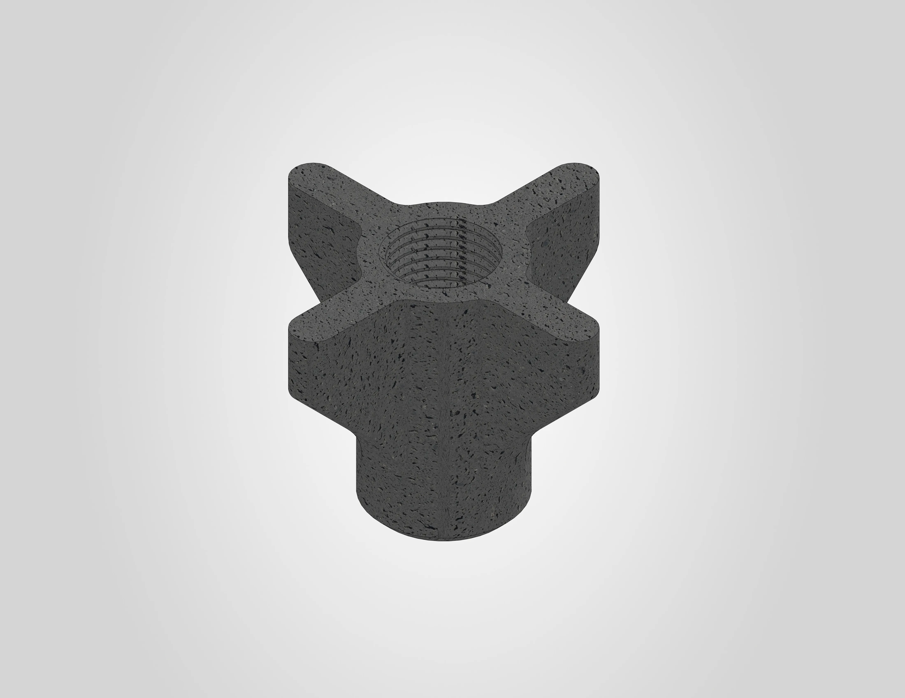
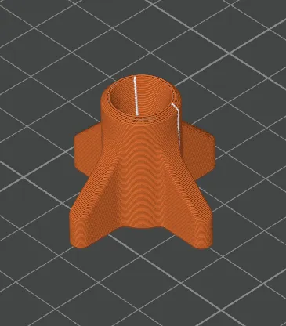

# Closing fastener

The closing fastener secures the pneumatic fittings to the drybox container from the inside. The 3MF file is pre-configured for a Bambu Lab H2S printer with the settings below already applied. If you are using a different printer, use the settings below as a reference.

A STEP file is also included for users who wish to slice the model independently or adapt it for a different printer.

| | |
|---|---|
| **Dimensions** | 33.4 x 33.4 x 24 mm |
| **Estimated print time** | ~9 minutes |
| **Required material** | PA6-GF |

---

## Before you print

!!! warning "Pre-drying is required"
    PA6-GF is extremely sensitive to moisture and **must** be dried before printing. For Polymaker PA6-GF20 Fiberon, dry at **100 °C for at least 12 hours** and keep the filament actively heated at a minimum of **80 °C** during printing to prevent moisture re-absorption. Other PA6-GF variants may have different drying requirements. Always follow the filament manufacturer's instructions.

!!! warning "Proper ventilation required"
    PA6-GF produces fumes during printing. Make sure your printer is enclosed and the room is well ventilated.

---

## Filament settings

The .3mf file uses a modified Bambu Lab PA6-GF profile. The following parameters were changed from the default profile:

| Setting | Value |
|---|---|
| Flow ratio | **0.864** |
| Bed temperature (initial + other layers) | **40 °C** |
| Nozzle temperature (initial + other layers) | **280 °C** |
| Part cooling fan | **off** |
| Density | **1.2** |
| Chamber temperature | **0 °C (off)** |
| Wipe while retraction | **enabled** |

This part has been tested and validated with **Polymaker PA6-GF20 Fiberon**. This is currently the only verified filament for this component.

!!! note "Printer-specific settings"
    The flow ratio of **0.864** was calibrated on a Bambu Lab H2S and may vary depending on your printer. The bed temperature of **40 °C** and disabled chamber heating are specifically tuned for Fiberon's warp-free technology. Other PA6-GF variants may require different flow ratios, bed and chamber temperatures. Always calibrate for your setup.

!!! warning "No alternative material types"
    This part is directly exposed to high temperatures during operation. Do **not** use PLA, PETG, ABS or other materials with a lower heat deflection temperature. Using an unsuitable material may result in deformation, failure, or a safety hazard. Other PA6-GF brands may work, but have not been officially tested or validated.

---

## Workspace settings

The following workspace settings were changed from the default settings:

| Setting | Value |
|---|---|
| Nozzle | **0.4 mm** |
| Layer height | **0.2 mm** |
| Build plate | **Engineering plate** |
| Sparse infill pattern | **Gyroid** |
| Supports | **disabled** |

!!! note "No adhesives needed"
    No glue or other adhesives are required on the engineering plate for this print.

The image below shows the sliced result:

---

## License & Disclaimer

!!! note "CC BY-NC 4.0"
    All files on this page are licensed under [CC BY-NC 4.0](https://creativecommons.org/licenses/by-nc/4.0/){:target="_blank"}. You are free to download, print, share and adapt them, as long as you credit Filametric and do not use them for commercial purposes. Printing parts for your own personal or business use is permitted. Selling the files, printed parts, or using them to build competing products is not.

!!! warning "Disclaimer"
    These files are provided as-is. Modifications to the model, print settings or orientation may affect fit and function and are at your own risk. See our [Terms of Use](https://filametric.com/terms-of-use){:target="_blank"} for more information.

---

## Downloads

- [:material-download: Closing Fastener (.3mf)](../downloads/Filametric_Closing_Fastener_3MF.3mf)
- [:material-download: Closing Fastener (.step)](../downloads/Filametric_Closing_Fastener_STEP.step)

