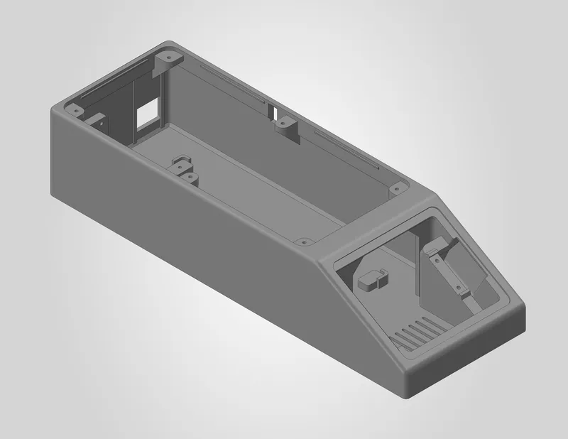
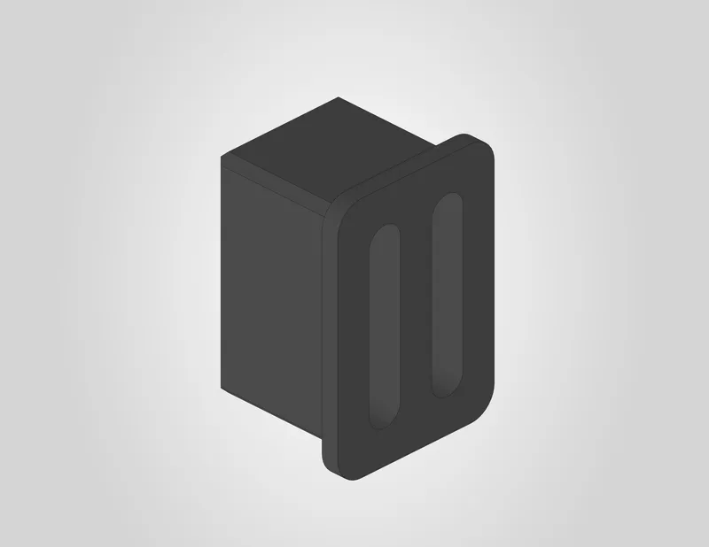
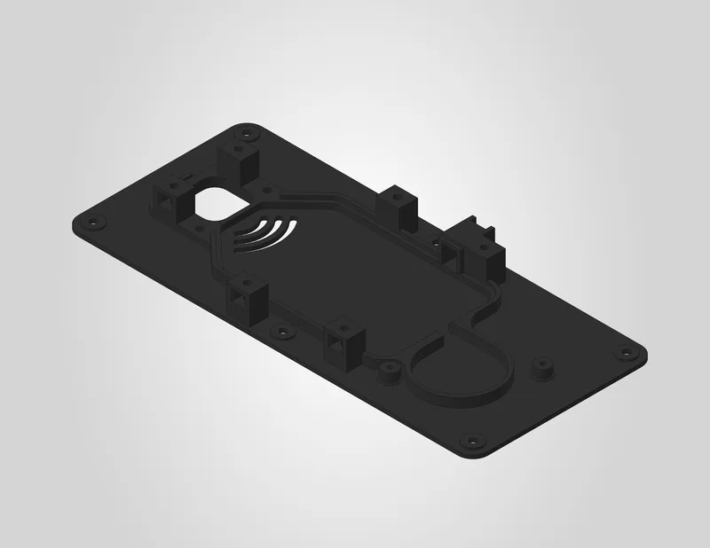
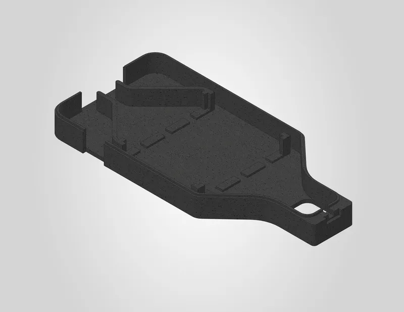
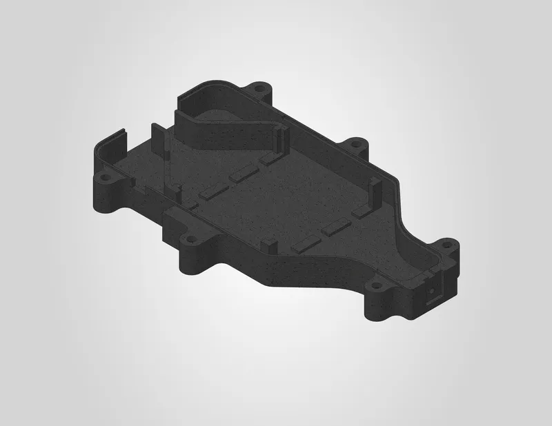
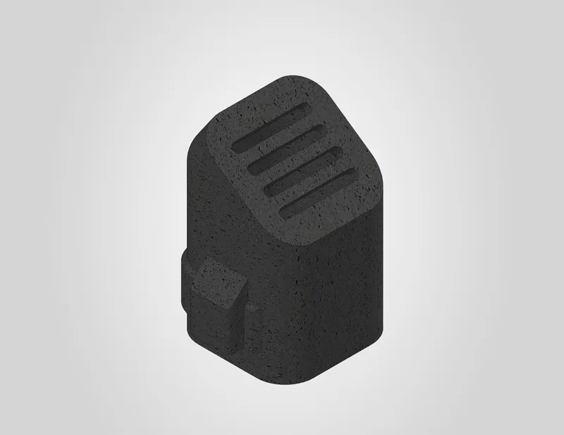
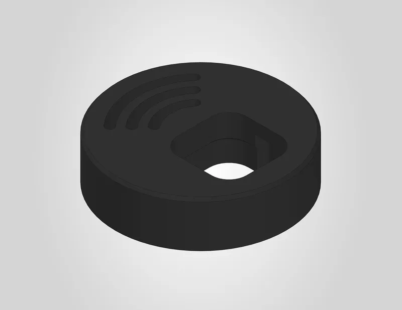

# DryBase

Select a component below to view its printing guide and download the files.

<a class="print-card" href="../../3d-printing/housing/">
  
  Housing
</a>

<a class="print-card" href="../../3d-printing/moist-air-exhaust-port/">
  
  Moist air exhaust port
</a>

<a class="print-card" href="../../3d-printing/heating-unit-baseplate/">
  
  Heating unit baseplate
</a>

<a class="print-card" href="../../3d-printing/heating-element-top-cover/">
  
  Heating element top cover
</a>

<a class="print-card" href="../../3d-printing/heating-element-bottom-cover/">
  
  Heating element bottom cover
</a>

<a class="print-card" href="../../3d-printing/hot-air-exhaust-port/">
  
  Hot air exhaust port
</a>

<a class="print-card" href="../../3d-printing/container-adapter/">
  
  Container adapter
</a>

