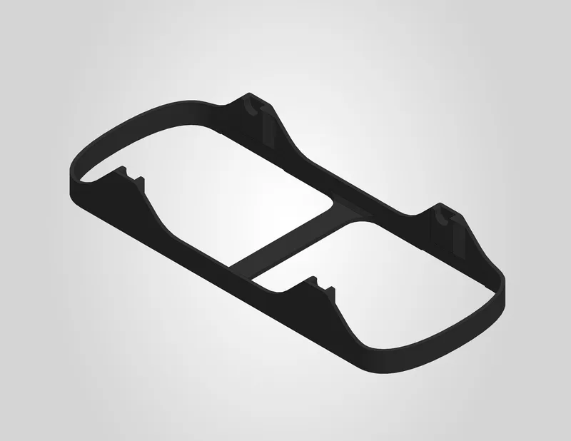
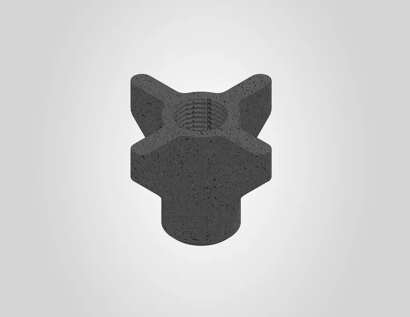

# Drybox

Select a component below to view its printing guide and download the files.

<a class="print-card" href="../../3d-printing/spool-holder/">
  
  Spool holder
</a>

<a class="print-card" href="../../3d-printing/closing-fastener/">
  
  Closing fastener
</a>

<a class="print-card" href="../../3d-printing/grommet/">
  
  Grommet
</a>

