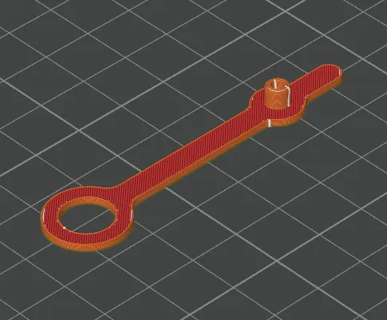

# Grommet

The grommet is used to seal unused openings on the drybox container. It is printed in flexible TPU to ensure a snug, airtight fit. The 3MF file is pre-configured for a Bambu Lab H2S printer with the settings below already applied. If you are using a different printer, use the settings below as a reference.

A STEP file is also included for users who wish to slice the model independently or adapt it for a different printer.

| | |
|---|---|
| **Dimensions** | 16 x 67.9 x 5.5 mm |
| **Estimated print time** | ~4 minutes |
| **Recommended material** | TPU 95A |

---

## Before you print

!!! warning "Pre-drying is required"
    TPU is sensitive to moisture and **must** be dried before printing. Follow the filament manufacturer's drying instructions.

---

## Filament settings

The .3mf file uses the default Bambu Lab TPU 95A HF profile. No parameters were changed from the default profile.

It is recommended to use **TPU 95A**, as this part has been tested and validated with Bambu Lab TPU 95A HF. Other TPU brands should work as well, as long as they have a similar shore hardness (95A or close to it).

---

## Workspace settings

The following workspace settings were changed from the default settings:

| Setting | Value |
|---|---|
| Layer height | **0.2 mm** |
| Build plate | **Engineering plate** |
| Sparse infill pattern | **Rectilinear** |
| Supports | **disabled** |

!!! note "No adhesives needed"
    No glue or other adhesives are required on the engineering plate for this print.

The image below shows the sliced result:

---

## License & Disclaimer

!!! note "CC BY-NC 4.0"
    All files on this page are licensed under [CC BY-NC 4.0](https://creativecommons.org/licenses/by-nc/4.0/){:target="_blank"}. You are free to download, print, share and adapt them, as long as you credit Filametric and do not use them for commercial purposes. Printing parts for your own personal or business use is permitted. Selling the files or using them to build competing products is not.

!!! warning "Disclaimer"
    These files are provided as-is. Modifications to the model, print settings or orientation may affect fit and function and are at your own risk. See our [Terms of Use](https://filametric.com/terms-of-use){:target="_blank"} for more information.

---

## Downloads

- [:material-download: Grommet (.step)](../downloads/Filametric_Grommet_STEP.step)

