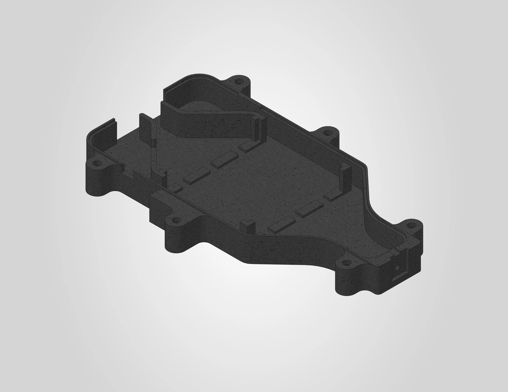
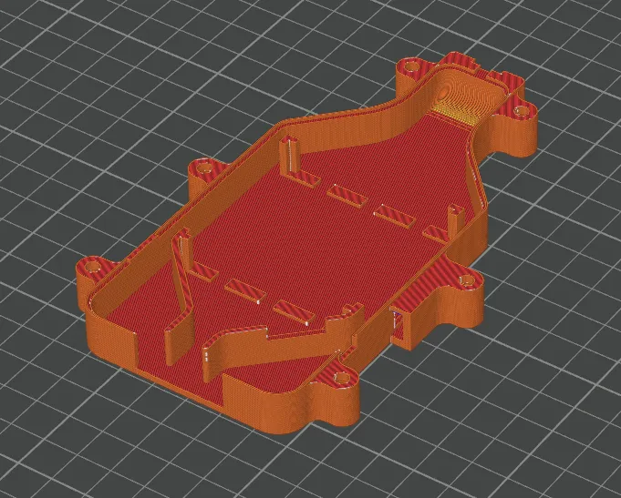

# Heating element bottom cover

The heating element bottom cover encloses the heating element from below and is directly exposed to high temperatures during operation. This part **must** be printed in a high-temperature resistant material. The 3MF file is pre-configured for a Bambu Lab H2S printer with the settings below already applied. If you are using a different printer, use the settings below as a reference.

A STEP file is also included for users who wish to slice the model independently or adapt it for a different printer.

| | |
|---|---|
| **Dimensions** | 88.5 x 138.2 x 12.9 mm |
| **Estimated print time** | ~1 hour |
| **Required material** | PA6-GF |

---

## Before you print

!!! warning "Filament drying is mandatory"
    PA6-GF is extremely sensitive to moisture and **must** be dried before printing. Dry the filament at **100 °C for at least 12 hours**. During printing, keep the filament actively heated at a minimum of **80 °C** to prevent moisture re-absorption.

!!! warning "Proper ventilation required"
    PA6-GF produces fumes during printing. Make sure your printer is enclosed and the room is well ventilated.

---

## Filament settings

The .3mf file uses a modified Bambu Lab PA6-GF profile. The following parameters were changed from the default profile:

| Setting | Value |
|---|---|
| Flow ratio | **0.864** |
| Bed temperature (initial + other layers) | **40 °C** |
| Nozzle temperature (initial + other layers) | **280 °C** |
| Part cooling fan | **off** |
| Density | **1.2** |

This part has been tested and validated with **Polymaker PA6-GF20 Fiberon**. This is currently the only verified filament for this component.

!!! warning "No alternative materials"
    This part is directly exposed to high temperatures during operation. Do **not** use PLA, PETG, ABS or other materials with a lower heat deflection temperature. Using an unsuitable material may result in deformation, failure, or a safety hazard.

---

## Workspace settings

The following workspace settings were changed from the default settings:

| Setting | Value |
|---|---|
| Layer height | **0.2 mm** |
| Build plate | **Engineering plate** |
| Sparse infill pattern | **Gyroid** |
| Seam position | **nearest** |
| Supports | **disabled** |

!!! note "No adhesives needed"
    No glue or other adhesives are required on the engineering plate for this print.

The image below shows the sliced result:

---

## License & Disclaimer

!!! note "CC BY-NC 4.0"
    All files on this page are licensed under [CC BY-NC 4.0](https://creativecommons.org/licenses/by-nc/4.0/){:target="_blank"}. You are free to download, print, share and adapt them, as long as you credit Filametric and do not use them for commercial purposes. Printing parts for your own personal or business use is permitted. Selling the files or using them to build competing products is not.

!!! warning "Disclaimer"
    These files are provided as-is. Modifications to the model, print settings or orientation may affect fit and function and are at your own risk. See our [Terms of Use](https://filametric.com/terms-of-use){:target="_blank"} for more information.

---

## Downloads

- [:material-download: Heating Element Bottom Cover (.step)](../downloads/Filametric_Heating_Element_Bottom_Cover_STEP.step)

