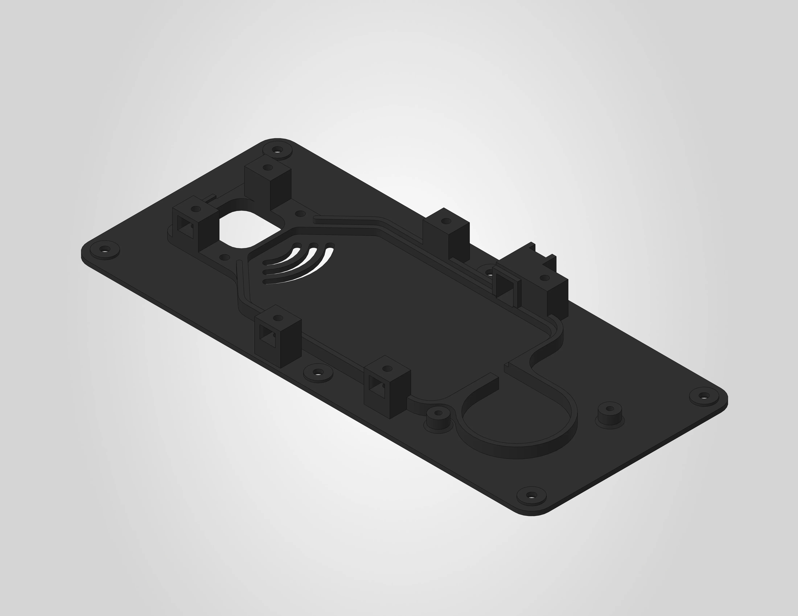
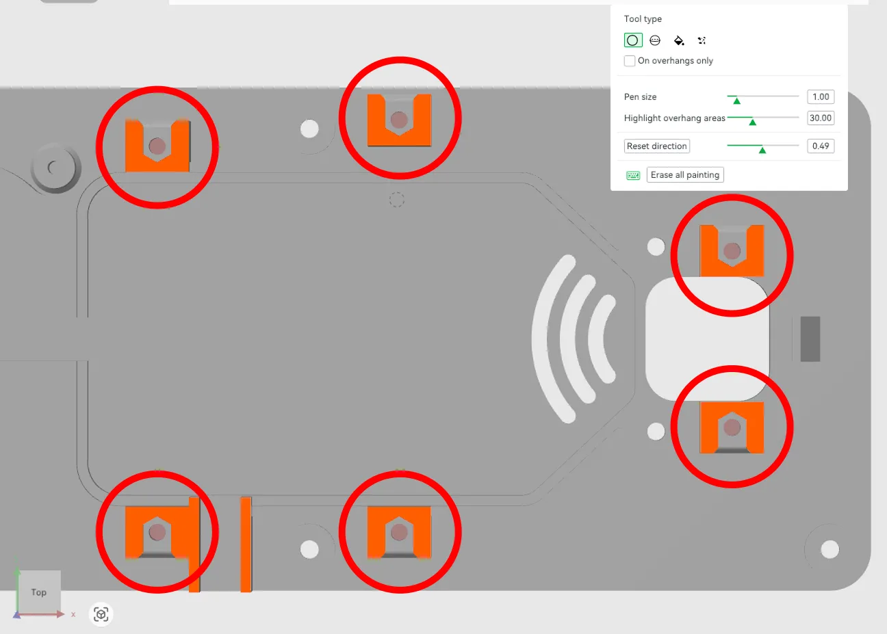
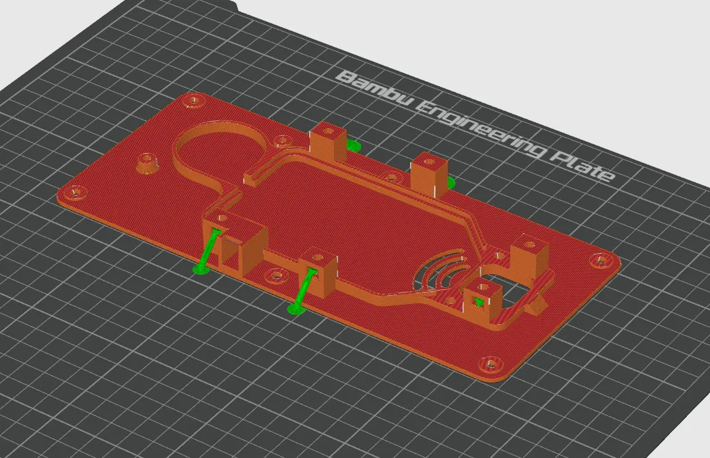

# Heating unit baseplate

The heating unit baseplate is the main structural part of the heating unit assembly. The 3MF file is pre-configured for a Bambu Lab H2S printer with the settings below already applied. If you are using a different printer, use the settings below as a reference.

A STEP file is also included for users who wish to slice the model independently or adapt it for a different printer.

| | |
|---|---|
| **Dimensions** | 218.8 x 98.1 x 17.2 mm |
| **Estimated print time** | ~1 hour 39 minutes |
| **Recommended material** | ABS |

---

## Before you print

!!! warning "Clean your build plate"
    Clean your build plate before printing to prevent warping. Wash the engineering plate with lukewarm water and dish soap, then dry it thoroughly before placing it on the printer.

!!! warning "ABS requires proper ventilation"
    ABS produces fumes during printing. Make sure your printer is enclosed and the room is well ventilated.

!!! warning "Pre-drying is required"
    ABS is sensitive to moisture and **must** be dried before printing. Follow the filament manufacturer's drying instructions.

---

## Filament settings

The .3mf file uses the generic Bambu Lab ABS profile. No parameters were changed from the default profile.

It is recommended to use **ABS**, as this part has been tested and validated with Bambu Lab ABS. Other ABS brands should work as well.

!!! warning "Other materials"
    Other materials may work but have not been officially tested or validated. Using alternative materials is at your own risk and may affect dimensional accuracy and fit.

---

## Workspace settings

The following workspace settings were changed from the default settings:

| Setting | Value |
|---|---|
| Layer height | **0.2 mm** |
| Build plate | **Engineering plate** |
| Sparse infill pattern | **Gyroid** |
| Supports | **enabled** |
| Type of support | **tree (auto)** |

!!! note "No adhesives needed"
    No glue or other adhesives are required on the engineering plate for this print.

### Support blockers

The baseplate has six nut pockets with cavities underneath. Support blockers have been manually painted inside these cavities to prevent support material from being generated there, as it would be very difficult to remove after printing. The support material in the nut pockets themselves is left in place and can be removed easily.

The image below shows the six support blockers (orange) highlighted with red circles:

The image below shows the sliced result. Notice how support material is present in the nut pockets but not in the cavities underneath:

**Do not remove or modify the support blockers in the 3MF file.**

---

## License

!!! note "CC BY-NC 4.0"
    All files on this page are licensed under [CC BY-NC 4.0](https://creativecommons.org/licenses/by-nc/4.0/){:target="_blank"}. You are free to download, print, share and adapt them, as long as you credit Filametric and do not use them for commercial purposes. Printing parts for your own personal or business use is permitted. Selling the files or using them to build competing products is not.

!!! warning "Disclaimer"
    These files are provided as-is. Modifications to the model, print settings or orientation may affect fit and function and are at your own risk.

---

## Downloads

- [:material-download: Heating Unit Baseplate (.step)](../downloads/Filametric_Heating_Unit_Baseplate_STEP.step)

