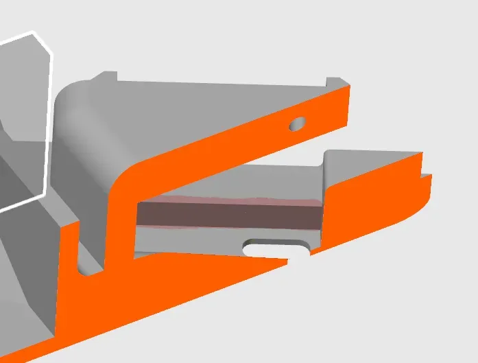
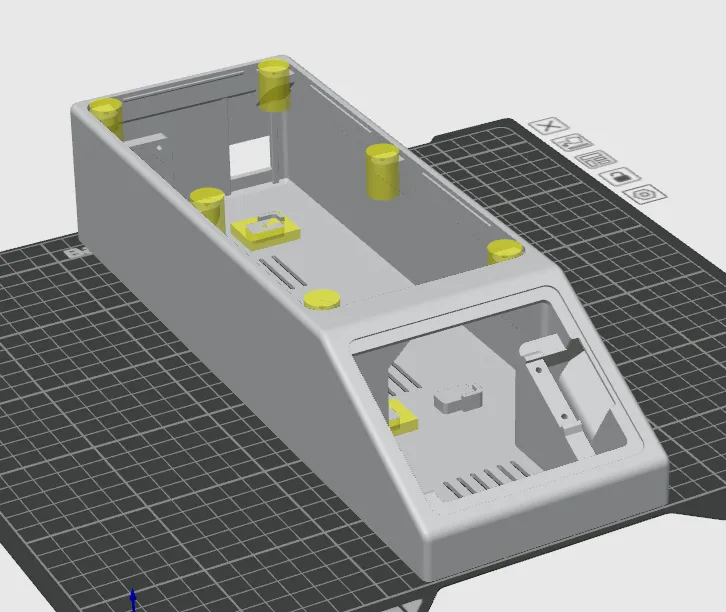

# DryBase Housing

The DryBase housing is a single-part print with dimensions of **318 x 108 x 67 mm**. Any printer with a build plate large enough to accommodate these dimensions can be used. The 3MF file is pre-configured for a Bambu Lab H2S printer with the settings below already applied, including modifiers for reinforced screw holes. If you are using a different printer, use the settings below as a reference.

A STEP file is also included for users who wish to slice the model independently or adapt it for a different printer.

| | |
|---|---|
| **Dimensions** | 318 x 108 x 67 mm |
| **Estimated print time** | ~6 hours |
| **Recommended material** | PLA |

---

## Before you print

!!! warning "Clean your build plate"
    Clean your build plate before printing to prevent warping. IPA alone is not sufficient. Wash the textured plate with lukewarm water and dish soap, then dry it thoroughly before placing it on the printer.

!!! note "Pre-drying not required"
    Pre-drying PLA is **not required** for this print.

---

## Filament settings

The .3mf file uses the generic Bambu Lab PLA Basic profile. The only parameter that was changed is the **value for the auxiliary fan, which was set to 0%**. This was done to prevent warping as much as possible.

It is recommended to use **PLA**, as it does not require pre-drying to achieve dimensional accuracy and a quality surface finish. This model has been tested and validated with Bambu Lab PLA Basic, but other PLA brands should work as well.

!!! warning "Other materials"
    Other materials such as PETG or ABS may work if the shrinkage/scaling factor is properly tuned, but have not been officially tested or validated. Using alternative materials is at your own risk and may affect dimensional accuracy, fit and assembly.

---

## Workspace settings

The following workspace settings were changed from the default settings:

| Setting | Value |
|---|---|
| Layer height | **0.2 mm** |
| Build plate | **Textured PEI** |
| Sparse infill pattern | **Gyroid** |
| Supports | **enabled** |
| Type of support | **tree (auto)** |
| Support style | **Tree Slim** |

!!! note "No adhesives needed"
    No glue or other adhesives are required on the build plate for this print, as long as the plate is properly cleaned.

Furthermore, the surface directly above the USB-C port opening was manually painted to disable supports.

Lastly, (yellow) modifiers were added to the model to apply 100% infill to the screw hole areas to ensure a strong, reliable connection during assembly. **Do not remove or modify them.**

---

## License & Disclaimer

!!! note "CC BY-NC 4.0"
    All files on this page are licensed under [CC BY-NC 4.0](https://creativecommons.org/licenses/by-nc/4.0/){:target="_blank"}. You are free to download, print, share and adapt them, as long as you credit Filametric and do not use them for commercial purposes. Printing parts for your own personal or business use is permitted. Selling the files or using them to build competing products is not.

!!! warning "Disclaimer"
    These files are provided as-is. Modifications to the model, print settings or orientation may affect fit and function and are at your own risk. See our [Terms of Use](https://filametric.com/terms-of-use){:target="_blank"} for more information.

---

## Downloads

- [:material-download: Housing (.3mf)](../downloads/Filametric_Housing_3MF.3mf)
- [:material-download: Housing (.step)](../downloads/Filametric_Housing_STEP.step)

