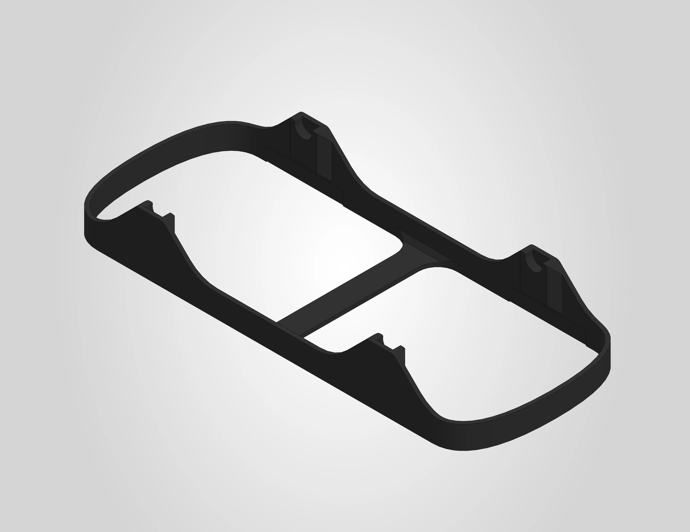
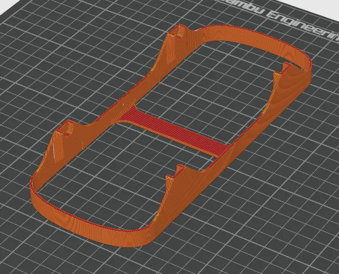

# Spool holder

The spool holder sits inside the drybox container lid and holds your filament spool in place. The 3MF file is pre-configured for a Bambu Lab H2S printer with the settings below already applied. If you are using a different printer, use the settings below as a reference.

A STEP file is also included for users who wish to slice the model independently or adapt it for a different printer.

| | |
|---|---|
| **Dimensions** | 86 x 216.5 x 30 mm |
| **Estimated print time** | ~44 minutes |
| **Recommended material** | ABS |

---

## Before you print

!!! warning "ABS requires proper ventilation"
    ABS produces fumes during printing. Make sure your printer is enclosed and the room is well ventilated.

!!! warning "Pre-drying is required"
    ABS is sensitive to moisture and **must** be dried before printing. Follow the filament manufacturer's drying instructions.

---

## Filament settings

The .3mf file uses the generic Bambu Lab ABS profile. No parameters were changed from the default profile.

It is recommended to use **ABS**, as this part has been tested and validated with Bambu Lab ABS. Other ABS brands should work as well.

!!! warning "Other materials"
    Other materials may work, but must have at least the same heat resistance as ABS, as these parts are exposed to elevated temperatures during operation. Alternative materials have not been officially tested or validated. Using them is at your own risk and may affect dimensional accuracy and fit.

---

## Workspace settings

The following workspace settings were changed from the default settings:

| Setting | Value |
|---|---|
| Nozzle | **0.4 mm** |
| Layer height | **0.2 mm** |
| Build plate | **Engineering plate** |
| Sparse infill pattern | **Gyroid** |
| Supports | **disabled** |

!!! note "No adhesives needed"
    No glue or other adhesives are required on the engineering plate for this print.

The image below shows the sliced result:

---

## License & Disclaimer

!!! note "CC BY-NC 4.0"
    All files on this page are licensed under [CC BY-NC 4.0](https://creativecommons.org/licenses/by-nc/4.0/){:target="_blank"}. You are free to download, print, share and adapt them, as long as you credit Filametric and do not use them for commercial purposes. Printing parts for your own personal or business use is permitted. Selling the files, printed parts, or using them to build competing products is not.

!!! warning "Disclaimer"
    These files are provided as-is. Modifications to the model, print settings or orientation may affect fit and function and are at your own risk. See our [Terms of Use](https://filametric.com/terms-of-use){:target="_blank"} for more information.

---

## Downloads

- [:material-download: Spool Holder (.3mf)](../downloads/Filametric_Spool_Holder_3MF.3mf)
- [:material-download: Spool Holder (.step)](../downloads/Filametric_Spool_Holder_STEP.step)

