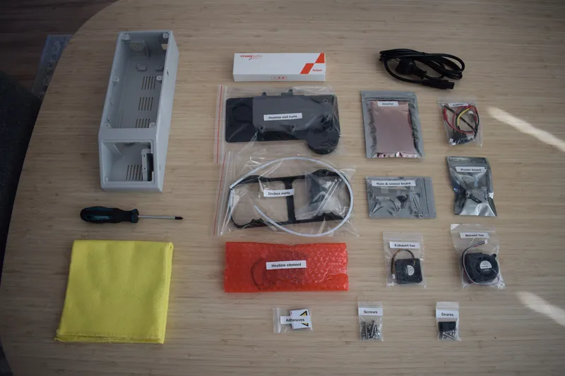
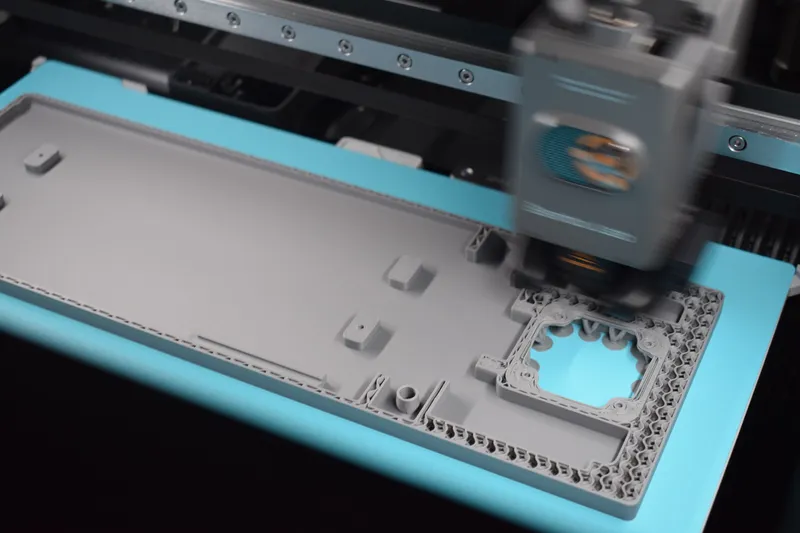
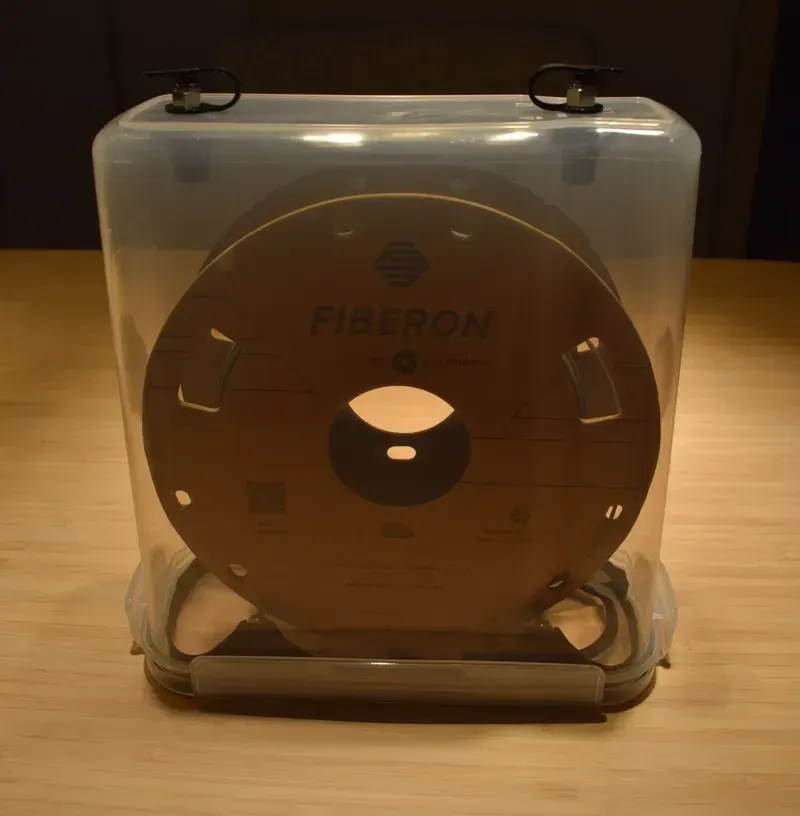
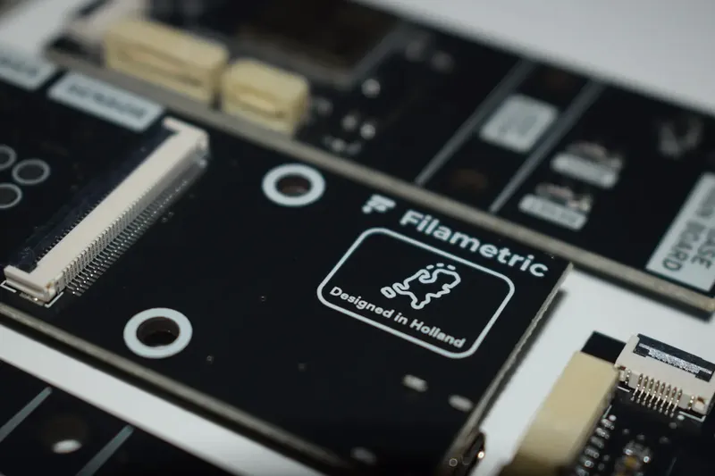

---
hide:
  - navigation
---

# Filametric Documentation

<a class="print-card" href="manual/introduction/">
  
  Assembly Manual
</a>

<a class="print-card" href="3d-printing/guide/">
  
  3D Printing
</a>

<a class="print-card" href="drybase/overview/">
  
  DryBase
</a>

<a class="print-card" href="drybox/overview/">
  
  Drybox
</a>

<a class="print-card" href="studio/overview/">
  
  
  Filametric Studio
</a>

<a class="print-card" href="support/faq/">
  
  Support
</a>

