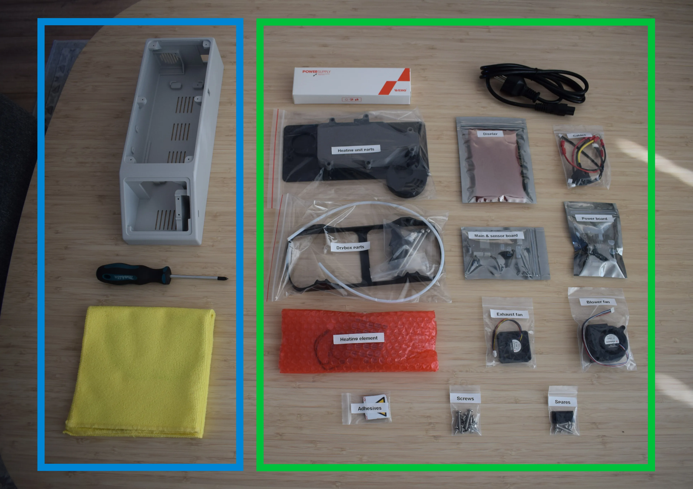

[:octicons-arrow-left-24: Introduction](introduction.md){ .md-button }

# Chapter 1: Unboxing & checking components

Before you begin the assembly, unbox your DryBase kit and verify that all components are present. Lay everything out on a clean, flat surface.

The image above is divided into two sections. The **blue box** on the left shows what you need to provide yourself. The **green box** on the right shows everything included in your kit.

## What you need to provide

- DryBase housing (3D-printed; see the [3D Printing guide](../3d-printing/guide.md) for material requirements)
- Phillips screwdriver
- 2mm hex/allen key
- Microfiber cloth (for handling components)

## What's included in your kit

From left to right, top to bottom:

- 150W Power Supply Unit (PSU)
- C5 1.5m power cord (region-specific)
- Heating unit parts (bag)
- Display (bag)
- Cables (bag)
- Drybox parts (bag)
- Main & sensor board (bag)
- Power board (bag)
- Heating element (bag)
- Exhaust fan (bag)
- Blower fan (bag)
- Adhesives (bag)
- Screws / fasteners (bag)
- Spares (bag)

!!! note "Missing or damaged parts?"
    Contact us at [support@filametric.com](mailto:support@filametric.com) with your order number and a photo of the issue before proceeding.

---

[:octicons-arrow-right-24: Chapter 2: Preparing the housing](chapter-2-preparing-housing.md){ .md-button .md-button--primary }
