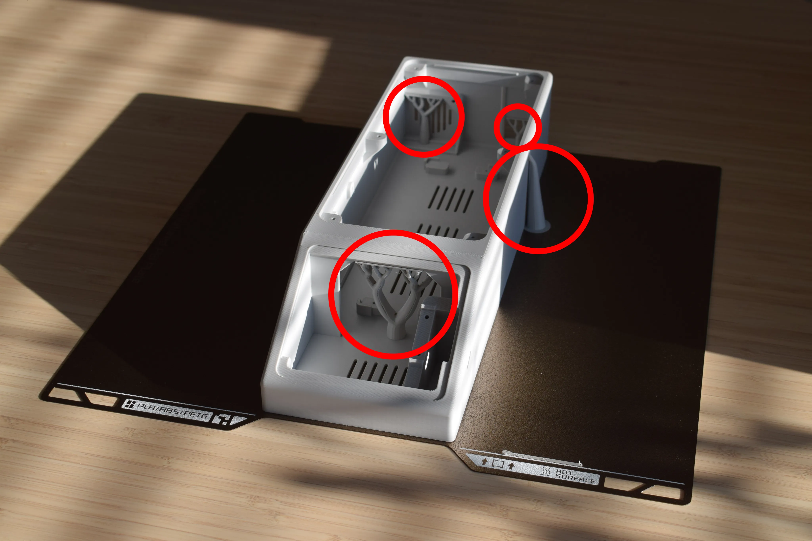
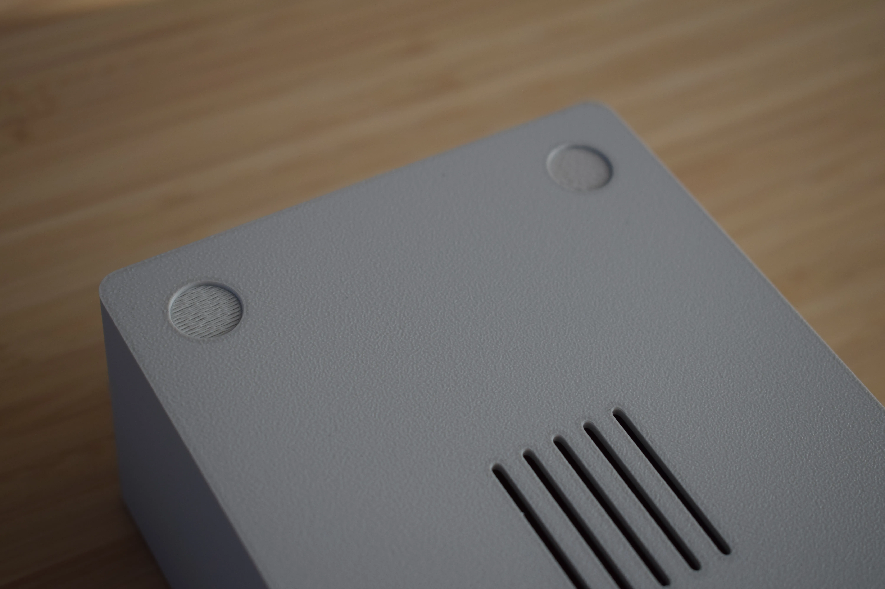
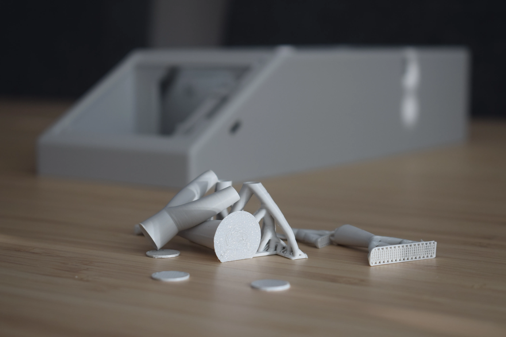

# Chapter 2: Preparing the DryBase housing

After printing your DryBase housing, it needs to be cleaned up before assembly. This chapter covers removing all support material.

## Step 1: Remove top support material

Locate and remove the tree support material from the inside of the housing. There are four locations, indicated by the red circles in the image below.

Use your hands or a pair of pliers to snap off the supports. They should break away cleanly. If any small stubs remain, trim them with flush cutters.

## Step 2: Remove bottom support material

Flip the housing over. Remove the support material from the four feet locations on the bottom, as shown below.

These supports are small and should be easy to remove using a flat tool or your fingernail.

## Result

With all supports removed, your housing should be clean and ready for assembly. The removed material will look something like this:

!!! note "Check your work"
    Run your fingers along the inside of the housing to make sure no leftover support material is sticking out. Any remaining stubs can interfere with component placement later on.

---

[:octicons-arrow-right-24: Continue to Chapter 3: Housing assembly](chapter-3-housing-assembly.md){ .md-button .md-button--primary }
