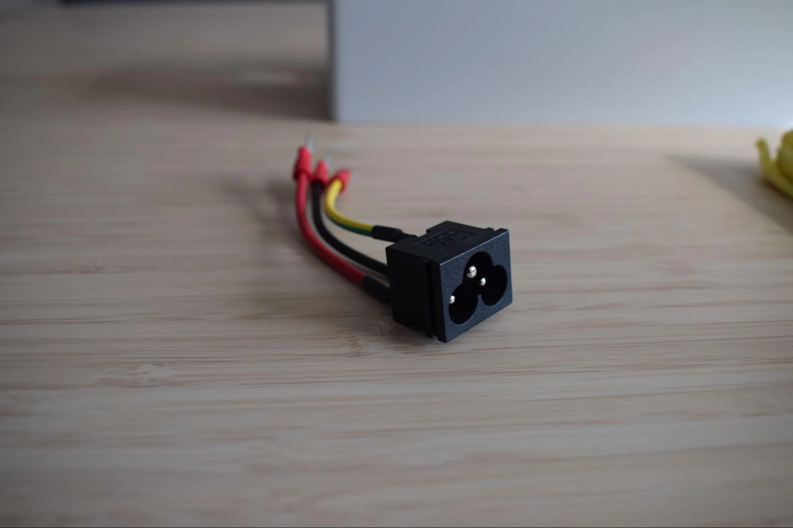
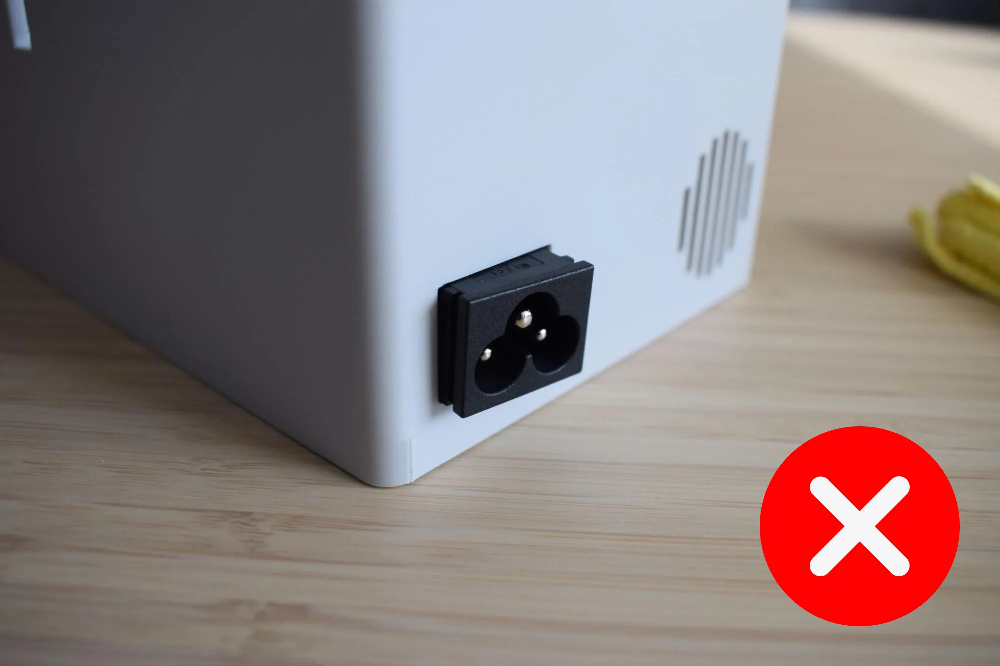
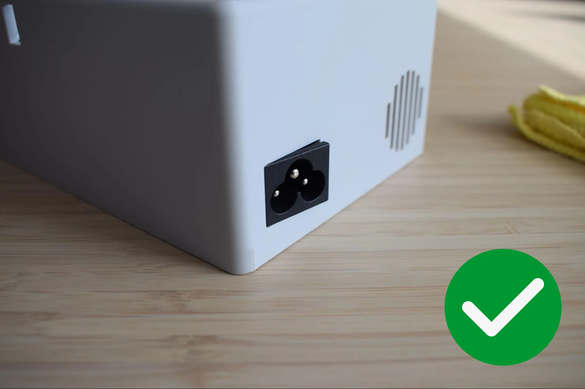
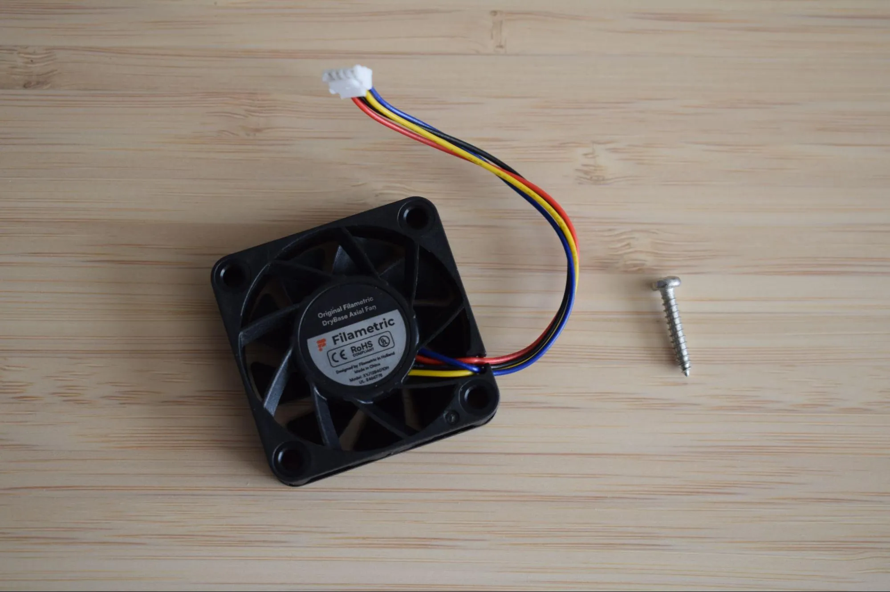
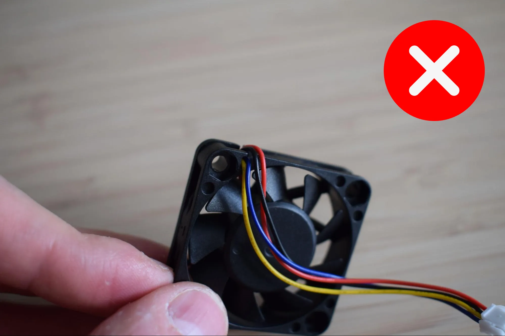
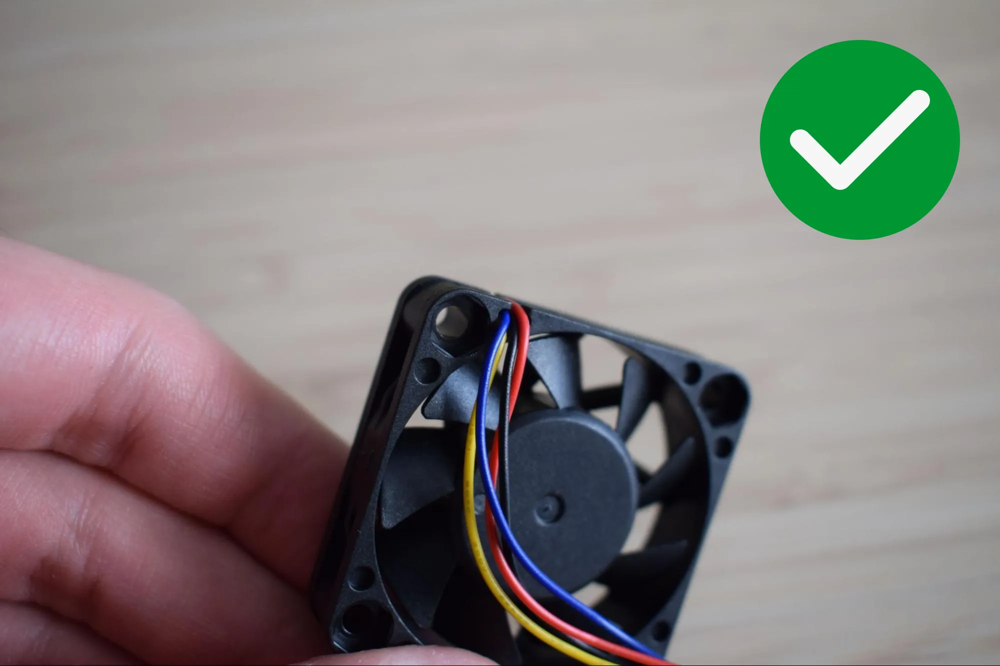

[:octicons-arrow-left-24: Chapter 2: Preparing the housing](chapter-2-preparing-housing.md){ .md-button }

# Chapter 3: Housing assembly

In this chapter you will assemble the housing, installing the power supply unit (PSU), exhaust fan, circuit boards, and display. This chapter takes roughly 60-90 minutes to complete. The result will look like the image below.

## Step 1: Installing the C6 inlet

**You will need:**

- DryBase housing
- C6 inlet (from the Cables bag)
- Microfiber cloth

**a.** Locate the power socket opening at the back of the housing and insert the C6 inlet, aligning it flush with the left edge. Refer to the images below for the correct orientation.

**b.** Stand the housing upright on the microfiber cloth with the back panel facing down. Then, apply firm downward pressure from the top until you hear and feel a clear snap. This confirms the inlet is seated.

The images below show how the correctly installed inlet looks from the outside and the inside of the housing.

!!! warning "Check the snap"
    If you did not hear or feel a clear snap, the inlet may not be fully seated. Remove it and try again. A loose inlet can cause connection issues later.

---

## Step 2: Installing the exhaust fan

**You will need:**

- Housing assembly (from the previous step)
- Exhaust fan (from the Exhaust fan bag)
- 1x 2.9 x 16mm flat-headed screw (DIN7981; from the Screws / Fasteners bag)
- Microfiber cloth
- Phillips screwdriver

**a.** Before installing the fan, route its cable so it runs flat along the side of the fan housing, not sticking out from the front. The cable should be tucked neatly against the fan body, not protruding outward.

**b.** Press the fan into the dedicated pocket at the back of the housing. Inserting it at a slight angle first, then pushing it flat, makes this easier. **Make sure the fan sticker is facing outward, towards the back of the housing.**

Once seated, ensure the cables are routed along the inside wall of the housing and are not pinched between the fan and the housing.

**c.** Secure the fan using the 2.9 x 16mm flat-headed screw and your Phillips screwdriver.

!!! warning "Do not overtighten"
    The housing is 3D-printed and the material can crack or strip if too much force is applied. Stop as soon as the fan sits firmly in place.

---

<!-- Steps 3+ will be added as content is provided -->
