[:octicons-arrow-left-24: Chapter 3: Housing assembly](chapter-3-housing-assembly.md){ .md-button }

# Chapter 4: Heating unit assembly

In this chapter you will assemble the heating unit, the core component responsible for generating and distributing heat inside the DryBase. This chapter takes roughly 45-60 minutes to complete. This sub-assembly will be connected to the housing in Chapter 5.

!!! note "Did you know?"
    The dark grey PA6-GF25 components in this chapter were dried at 100°C before and during printing, in a Filametric DryBase of course. This ensures the tightest tolerances, the best possible fit during assembly and a high-quality surface finish.

## Step 1: Preparing the heating element enclosure

**You will need:**

- Heating element (from the Heating element bag)
- Heating unit parts (from the Heating unit parts bag)
- Microfiber cloth

**a.** Remove the heating element and both the top and bottom covers from their bags. Place them on the microfiber cloth. Remove the plastic protective cap from the thermal cut-off as shown in the image below.

**b.** Place the heating element into the bottom cover, aligning it with the four corner clips as indicated by the red markers in the image below. Press it down gently until it sits flat and is fully seated in the enclosure.

**c.** Inspect the thermal cut-off pocket on the side of the enclosure for any obstructions, such as remaining print material and remove if necessary. Slide the thermal cut-off into the pocket as shown in the images below, then push it all the way in using your finger or fingernail until it sits flush with the edge of the enclosure.

!!! warning "Do not use a sharp tool"
    Do not use a sharp tool to push the thermal cut-off into place. A screwdriver or similar object can damage the component. Use your finger or fingernail only.

**d.** Route the cables along the inside of the bottom cover as shown in the images below. Make sure the cables run through the dedicated cable channel and do not cross over the heating element cover.

**e.** Place the top cover onto the bottom cover. It should close without force.

!!! warning "Do not force the cover"
    If it does not close easily, the cables are likely not routed correctly. Remove the cover, check the cable routing from step d, and try again.

Confirm that the assembly matches the images below before continuing.

---

## Step 2: Installing the heating element assembly onto the baseplate

**You will need:**

- Heating element assembly (from the previous step)
- Heating unit baseplate (from the Heating unit parts bag; the flat black rectangular plate)
- 6x M3 x 12mm hex bolt (DIN 7984; from the Screws / Fasteners bag)
- 6x M3 nylon nut (DIN 985; from the Screws / Fasteners bag)
- Microfiber cloth
- 2mm hex/allen key

**a.** Place the baseplate on the microfiber cloth with the nut pockets facing up. Locate all six nut pockets as indicated by the red circles in the image below.

**b.** Take the 6x M3 nylon nuts and partially insert one into each pocket, with the pointed end facing outward as shown in the images below.

!!! warning "Correct orientation"
    Insert the nuts in the correct orientation before pushing them in fully. Once fully seated, they cannot be removed. Refer to the images below for the correct orientation.

**c.** Push each nut fully into its pocket using a screwdriver to apply gentle pressure. **Do not use excessive force.** Press until the nut sits flush and the threaded hole is aligned with the bolt hole in the pocket.

!!! warning "Do not scratch or damage the surrounding surface"
    When using the screwdriver to push the nuts in, apply pressure directly onto the nut only.

**d.** Verify that all six nuts are fully seated. The nut should not be visible from above, only the threaded hole should remain visible, aligned with the bolt hole, as shown in the images below.

**e.** Pick up the heating element assembly and position it onto the baseplate, inserting the left side first as shown in the image below. Once the left side is aligned, lower the right side down until the assembly sits flat on the baseplate.

Once released, confirm it sits flat and all mounting holes are aligned, as shown in the image below.

**f.** Apply light pressure across the assembly to ensure full contact with the baseplate.

**g.** Confirm the assembly is correctly seated by checking both connection points as shown in the images below. The heating element enclosure should sit flush against the baseplate with no visible gap on either side.

**h.** Using the 2mm hex/allen key, insert and tighten all six M3 x 12mm hex bolts in the order indicated in the image below (1 to 6).

!!! warning "Do not overtighten"
    The nylon nuts are seated in 3D-printed pockets. Excessive force can cause them to spin and lose their grip. The nylon locking insert already provides sufficient holding force. **Tighten until snug and stop.**

**i.** Verify that all sides are flush and no visible gap exists between the top and bottom covers of the heating element enclosure. The images below show a correctly assembled result.

---

## Step 3: Installing the blower fan, container adapter and hot air exhaust port

**You will need:**

- Heating unit assembly (from the previous step)
- Blower fan bag
- Container adapter part (from the Heating unit parts bag; the round black part shown in the top left corner of the image below)
- Hot air exhaust port (from the Heating unit parts bag; the dark grey part shown in the top right corner of the image below)
- 2x 2.9 x 16mm flat-headed screw (DIN7981; from the Screws / Fasteners bag)
- 2x 3.9 x 25mm flat-headed screw (DIN7981; from the Screws / Fasteners bag)
- Adhesives bag (not in the picture below)
- Microfiber cloth
- Phillips screwdriver

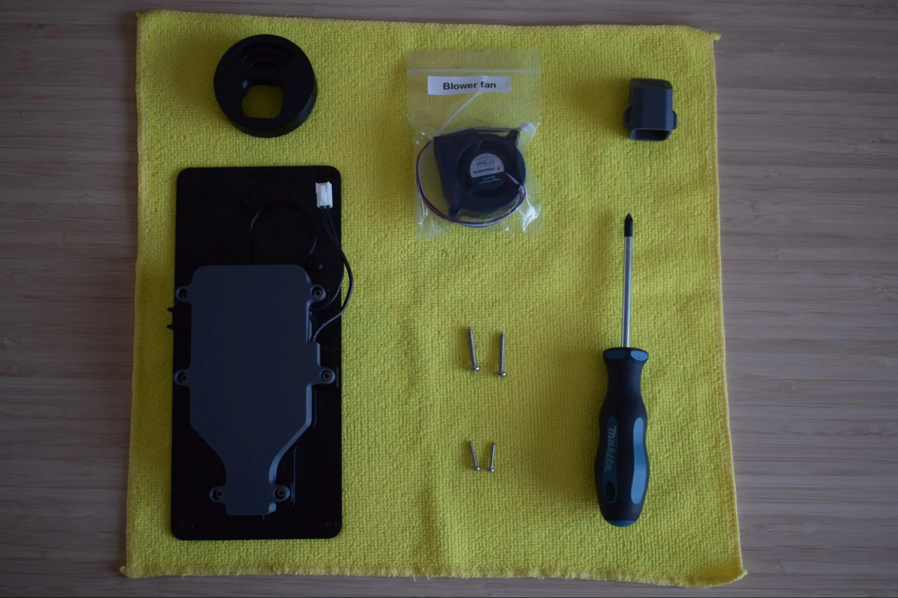

**a.** Remove the blower fan from its bag and place it onto the heating unit assembly, aligning it with the two mounting holes on the baseplate as shown in the images below. Make sure the fan label is facing downward, towards the baseplate.

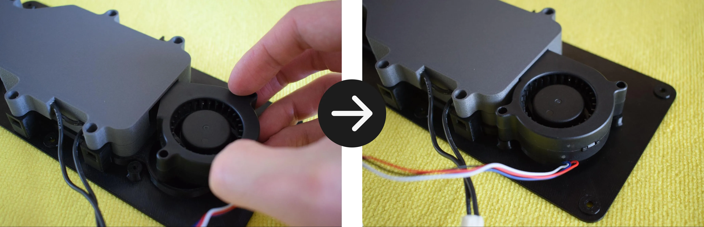

**b.** Using the 2x 3.9 x 25mm flat-headed screws and your Phillips screwdriver, secure the blower fan to the baseplate through both mounting holes.

!!! warning "Do not overtighten"
    The baseplate is 3D-printed and the material can crack or strip if too much force is applied. Stop as soon as the blower fan sits firmly in place.

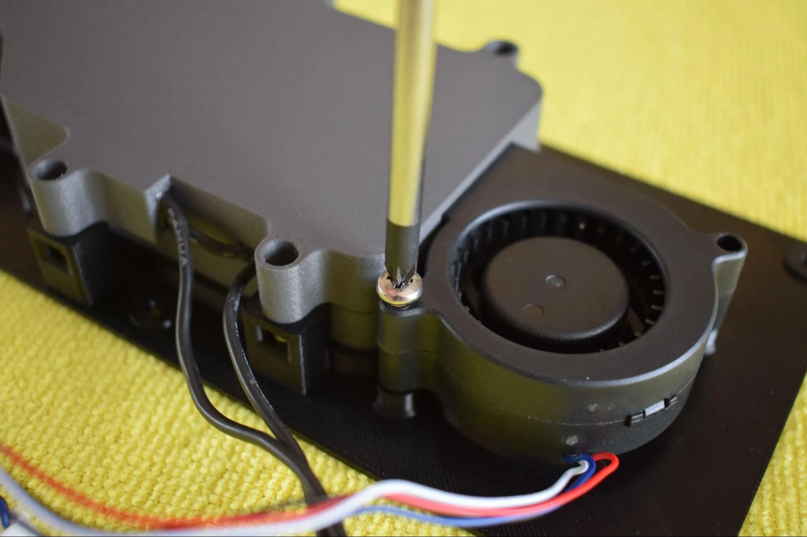

Confirm the fan is correctly secured as shown in the image below.

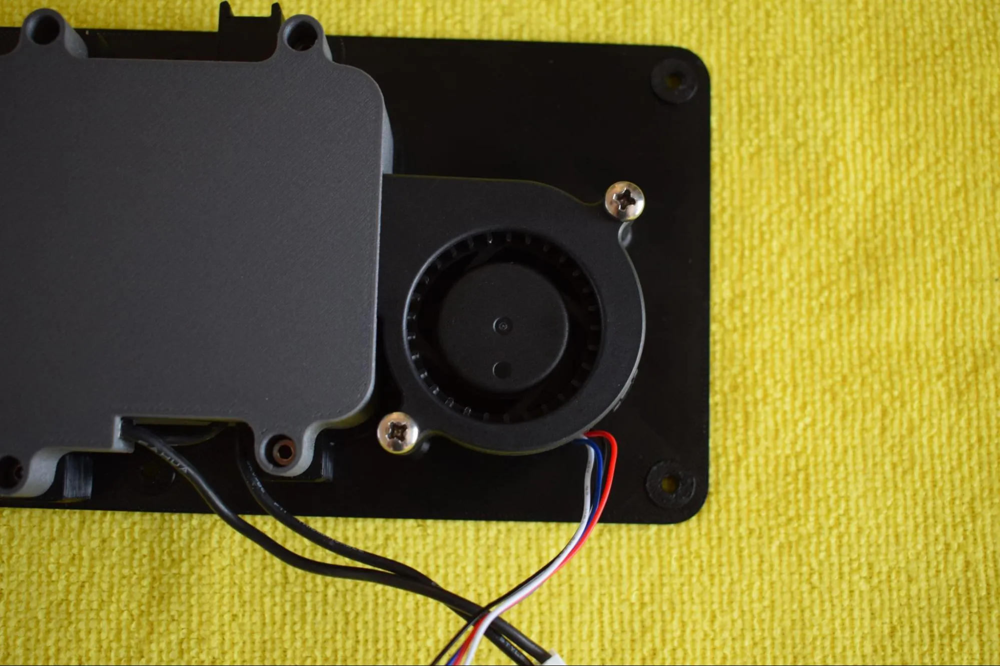

**c.** Take the tie wrap from the Blower fan bag and slide it through the dedicated slot on the baseplate from the left side, as shown in the images below.

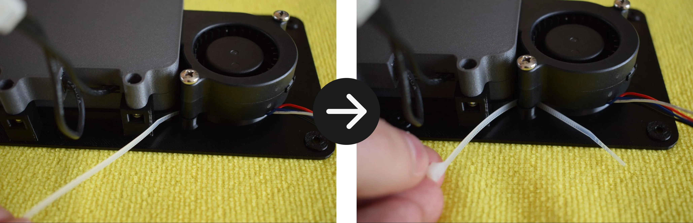

**d.** Pass the blower fan cable through the tie wrap. Pull the tie wrap tight enough to secure the cable against the baseplate, then trim off the excess with scissors or pliers. Make sure there is no excess slack on the right side of the fan. The goal is to keep the cable routed neatly along the left side.

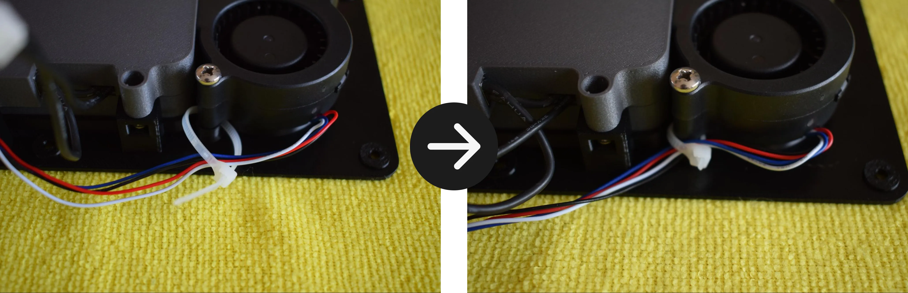

Refer to the image below for the correct result.

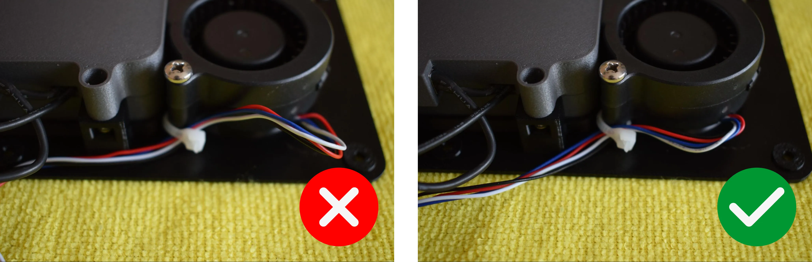

**e.** Remove the container adapter and hot air exhaust port from the Heating unit parts bag and place them on the microfiber cloth as shown in the image below.

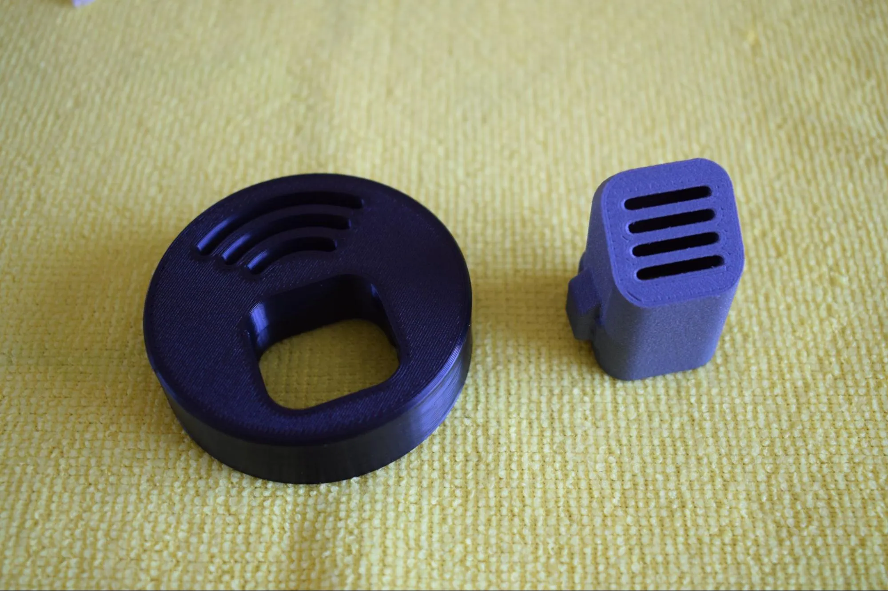

**f.** Turn the container adapter upside down so the two holes are facing upward. Insert the hot air exhaust port into the container adapter. Note that there is only one correct orientation in which it will fit. Do not force it.

!!! warning "Do not force the exhaust port into the adapter"
    If it does not slide in easily, rotate it and try again. There is only one orientation in which it fits correctly.

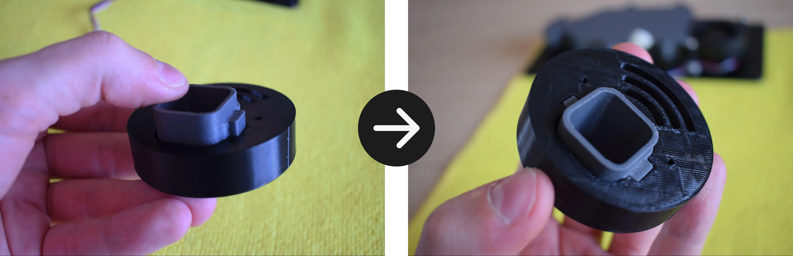

The tabs of the hot air exhaust port should sit fully flush with the bottom face of the container adapter, as shown in the image below. The other side should look like the second image below.

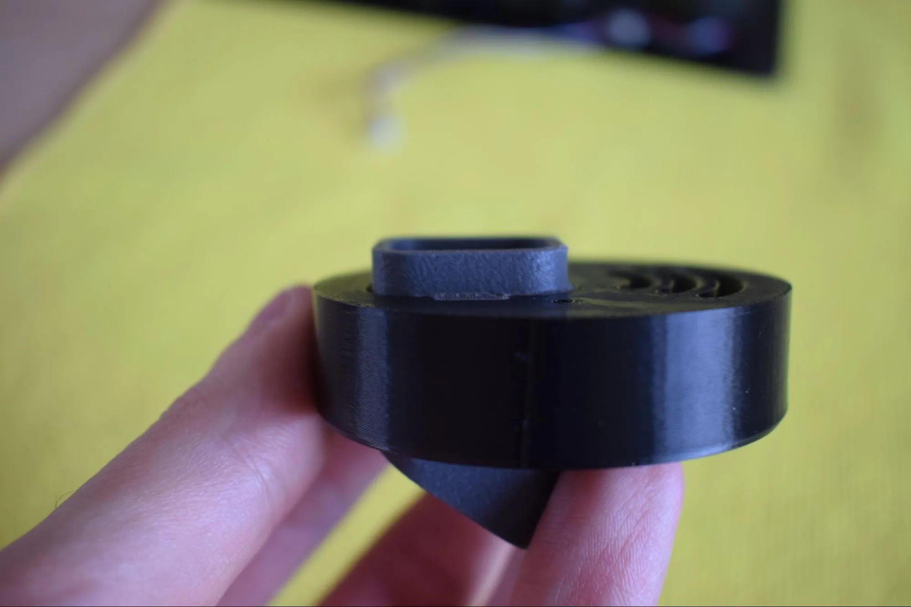

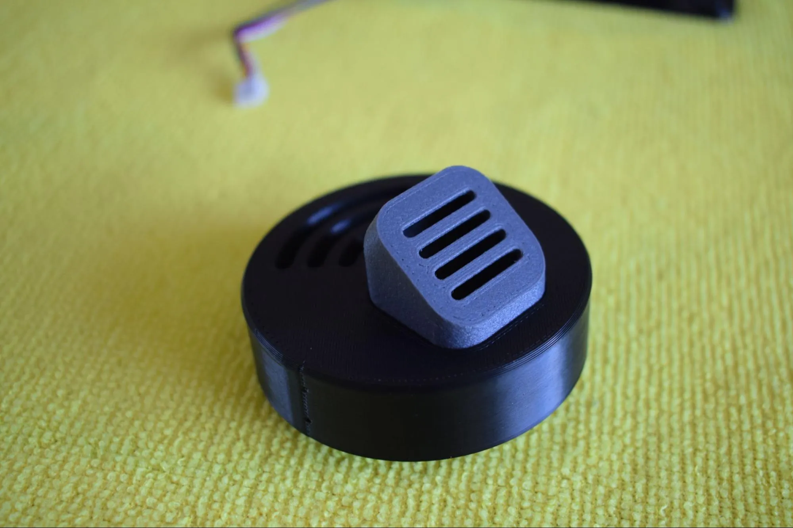

**g.** Take the assembled container adapter and place it onto the heating unit assembly, aligning it with the opening in the baseplate. The exhaust port should be facing towards you as shown in the images below.

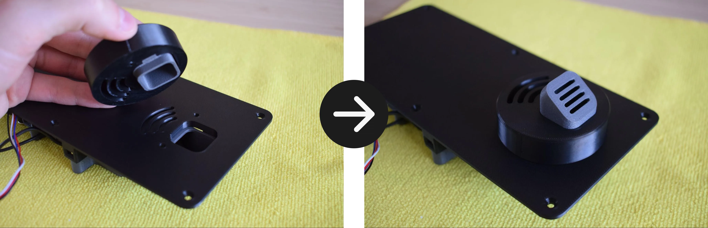

**h.** While holding the assembly in place, secure the container adapter using the 2x 2.9 x 16mm flat-headed screws, one on each side, using your Phillips screwdriver.

!!! warning "Do not overtighten"
    The container adapter is 3D-printed and the material can crack or strip if too much force is applied. Stop as soon as the container adapter sits firmly in place.

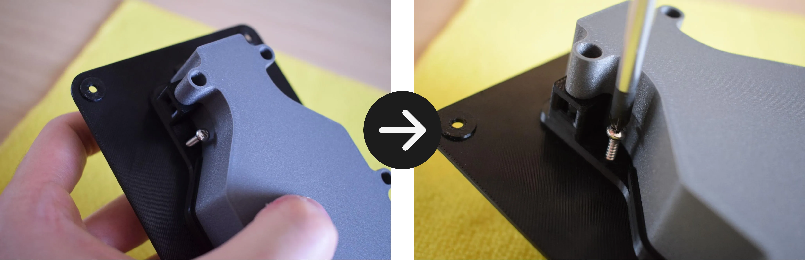

**i.** Verify that all parts are correctly aligned with the baseplate and that no visible gaps exist between any of the components. The images below show a correctly assembled result.

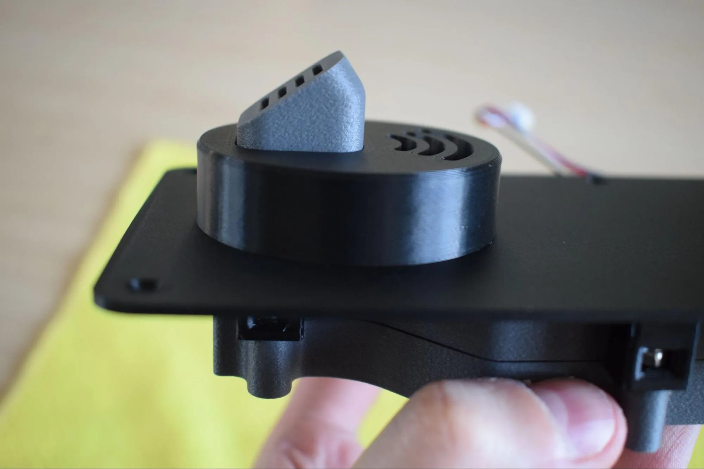

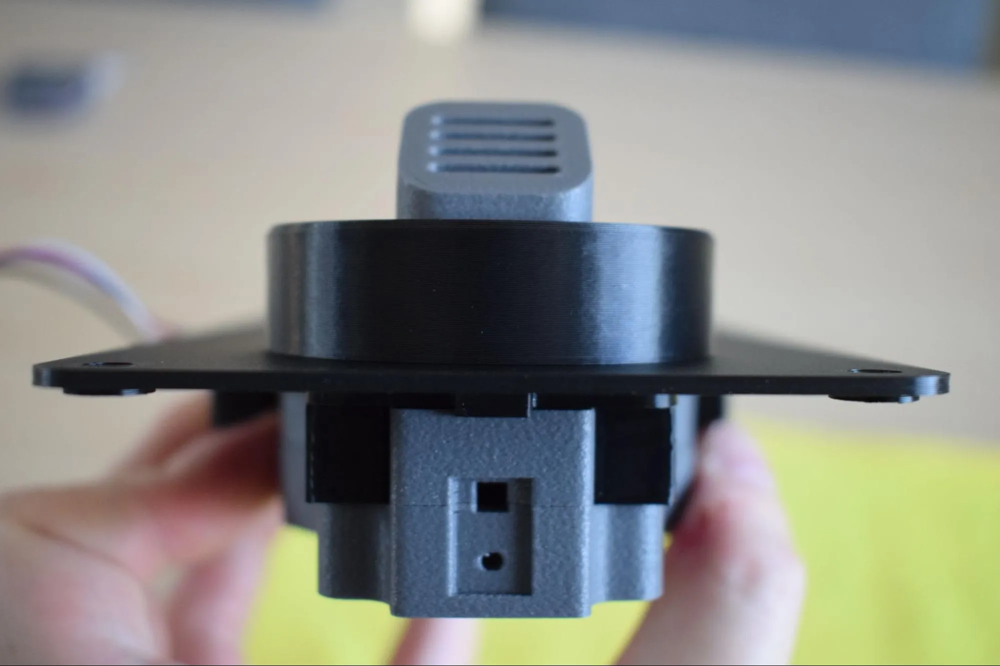

**j.** Remove the 'caution hot surface' sticker from the Adhesives bag and apply it to the top of the baseplate, centered between the container adapter and the edge of the plate, as shown in the image below.

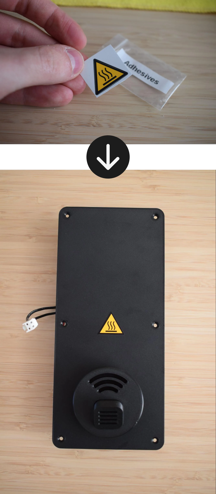

---

**Congratulations!** You have completed the Heating Unit Assembly.

The heating unit is now fully assembled and ready to be connected to the housing. Before continuing to the next chapter, take a moment to verify the following:

- [x] The blower fan is secured with two screws and the cable is neatly routed with the tie wrap
- [x] The hot air exhaust port sits flush within the container adapter with no visible gap
- [x] The container adapter is secured with two screws and sits flush against the baseplate
- [x] The 'caution hot surface' sticker is applied to the top of the baseplate
- [x] No visible gaps exist between any of the components

In the next chapter, you will connect the heating unit to the housing to complete your **DryBase**.

---

[:octicons-arrow-right-24: Chapter 5: DryBase assembly](chapter-5-drybase-assembly.md){ .md-button .md-button--primary }
