[:octicons-arrow-left-24: Chapter 4: Heating unit assembly](chapter-4-heating-unit-assembly.md){ .md-button }

# Chapter 5: DryBase assembly

In this chapter you will install the heating unit into the housing to complete your DryBase. This is the final assembly step and by the end of this chapter, your DryBase will be fully assembled and ready for use. This chapter takes roughly 30 minutes to complete.

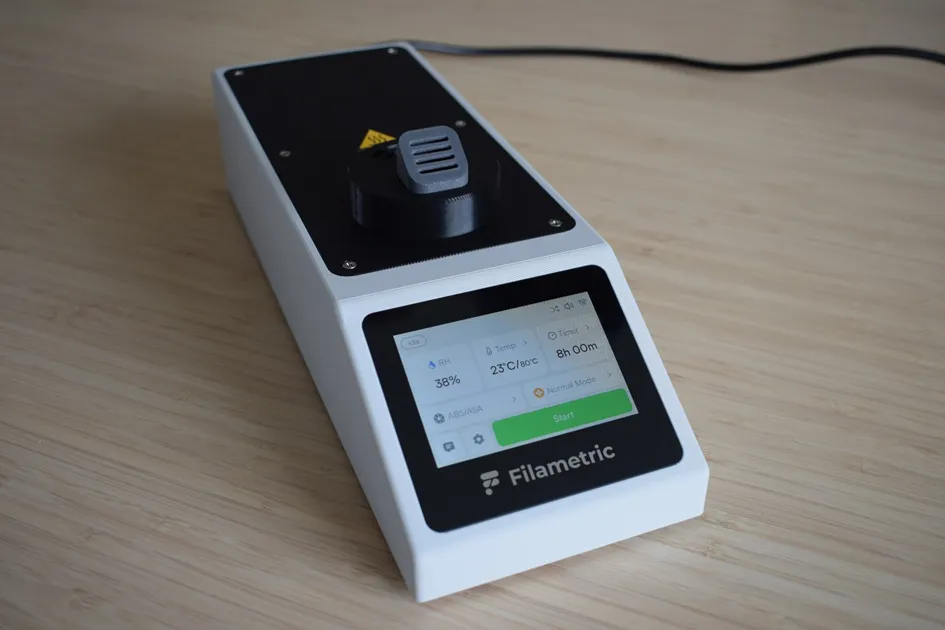

## Step 1: Installing the heating unit assembly into the housing

**You will need:**

- Completed housing assembly *(from Chapter 3)*
- Completed heating unit assembly *(from Chapter 4)*
- Moist air exhaust port *(final part from 'Heating unit parts' bag)*
- 1x 2.9 x 6.5mm flat-headed screw *(DIN7981; from the Screws / Fasteners bag)*
- 6x 2.9 x 9.5mm countersunk screw *(DIN7982; from the Screws / Fasteners bag)*
- Microfiber cloth
- Phillips screwdriver
- C5 1.5m power cord cable *(not shown in the picture below)*

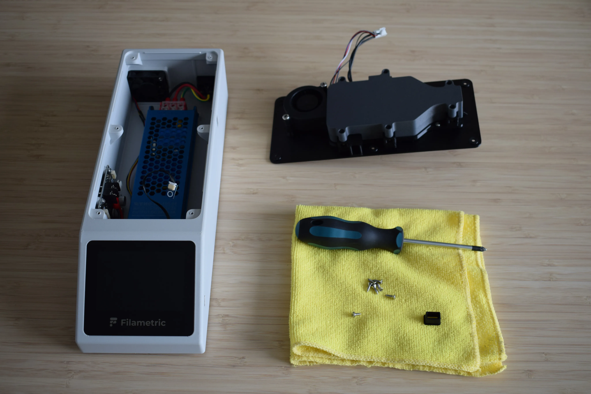

**a.** Locate the rectangular cut-out on the right side of the housing. Take the moist air exhaust port and push it into the cut-out as shown in the images below. Make sure the part sits flush with the side of the housing. The orientation does not matter.

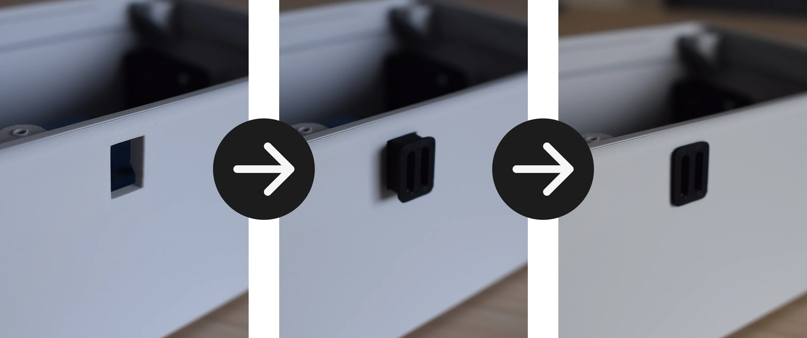

**b.** Hold the heating unit with your left hand and connect the heating element cable to the power board, as indicated by the red circle in the image below. An audible click should be heard. Give the cable a small tug to confirm it is properly seated.

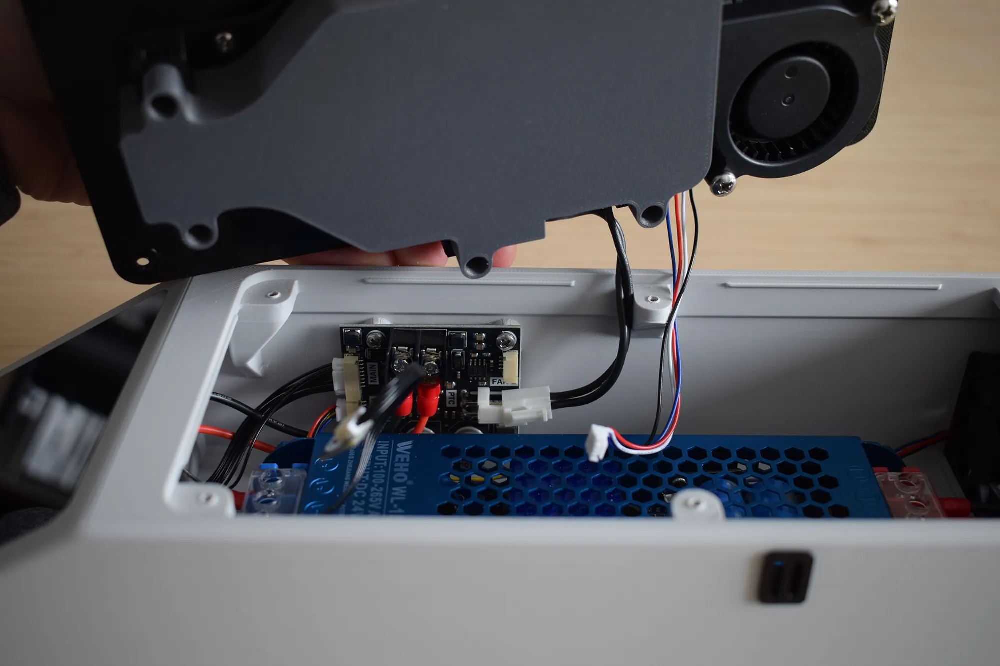

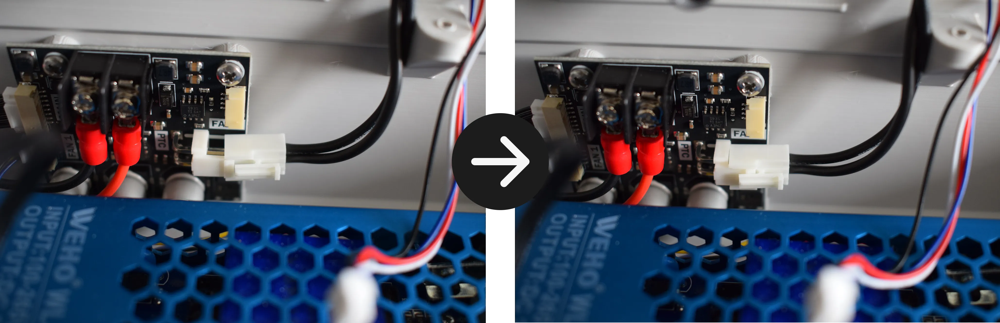

**c.** While still holding the heating unit with your left hand, connect the blower fan cable to the power board as indicated by the red circle in the image below. An audible click should be heard. Give the cable a small tug to confirm it is properly seated.

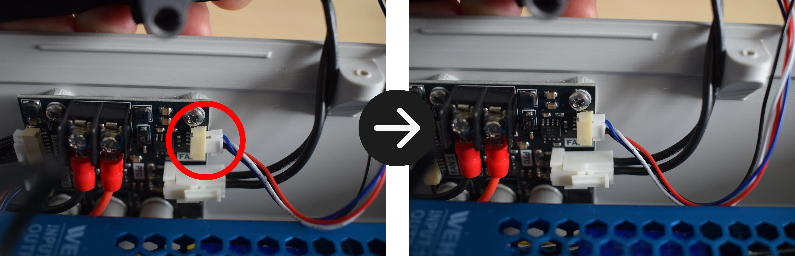

**d.** Lean the heating unit against the back of the housing as shown in the left image below, keeping the front side upright. Take the sensor board together with its cable and position it at the front of the heating unit, aligning the mounting holes as shown in the right image below.

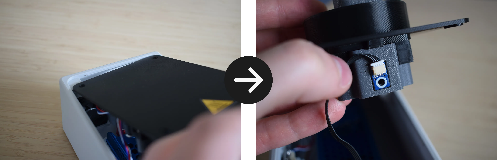

**e.** Using the 1x 2.9 x 6.5mm flat-headed screw and your Phillips screwdriver, secure the sensor board to the heating unit.

!!! warning "Do not overtighten"
    The heating unit cover is 3D-printed and the material can crack or strip if too much force is applied. Stop as soon as the sensor board sits firmly in place.

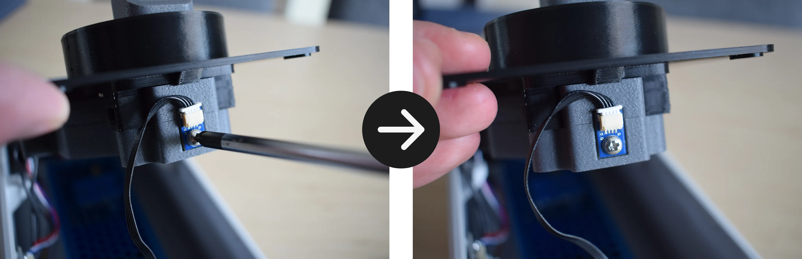

**f.** You are now ready to lower the heating unit into the housing. Before doing so, read through this step completely before proceeding.

!!! warning "Do not force the heating unit down"
    Lower it evenly on all sides simultaneously, keeping the wires clear on the left side and the moist air exhaust port aligned with the cut-out on the right side (when viewing from the front of the DryBase).

Make sure the moist air exhaust port and the heating unit are aligned as shown in the image below.

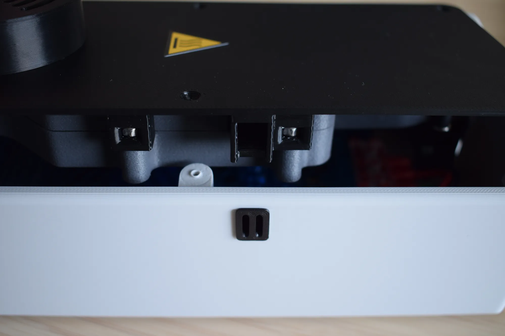

Verify the following before continuing:

On the right side, ensure the moist air exhaust port aligns flush with the cut-out in the housing, as shown in the images below.

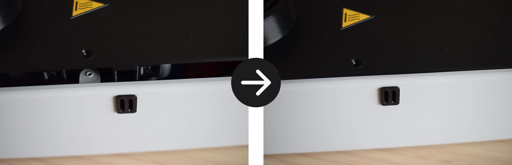

On the left side, make sure no wires are pinched between the housing and the heating unit, as shown in the correct and incorrect images below.

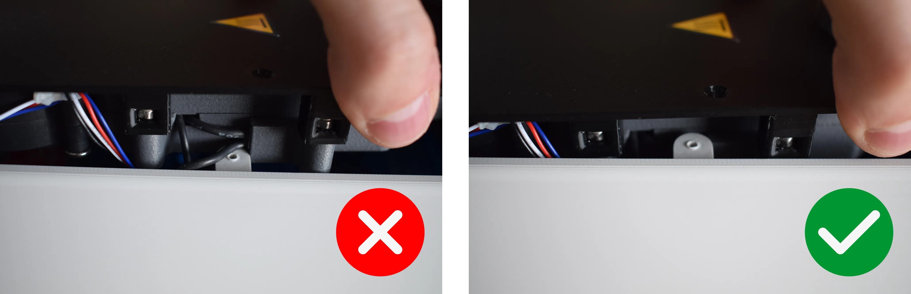

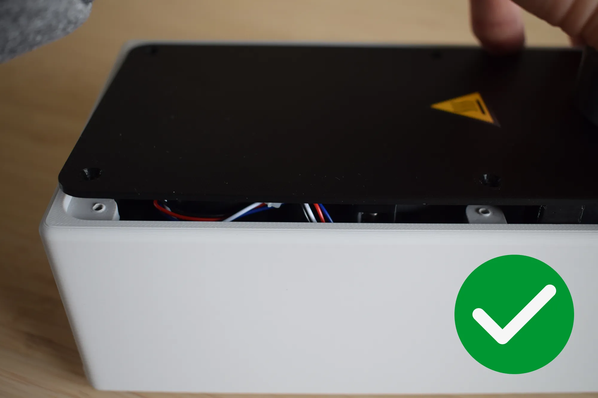

Ensure the corners on both the front and back are properly aligned with no debris or cables caught between the heating unit and the housing.

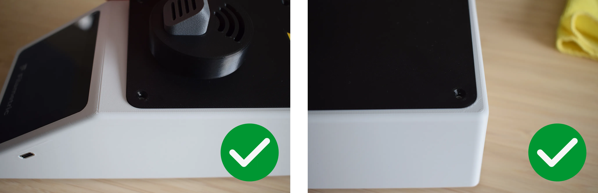

The final result should show no visible gap between the heating unit and the housing, as shown in the image below.

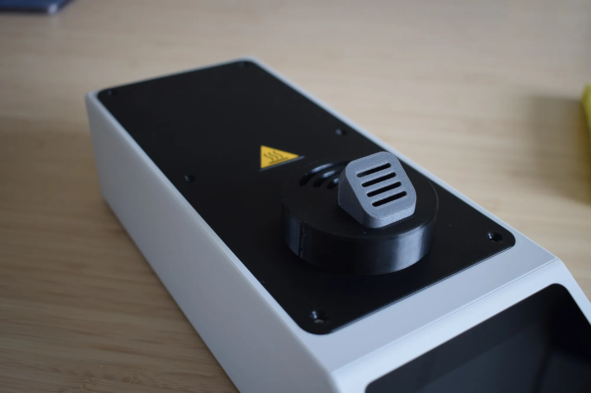

**g.** Using your Phillips screwdriver, insert and tighten all six 2.9 x 9.5mm countersunk screws in the order shown in the image below (1 to 6).

!!! warning "Do not overtighten"
    The housing is 3D-printed and the material can crack or strip if too much force is applied. Stop as soon as the heating unit sits firmly in place.

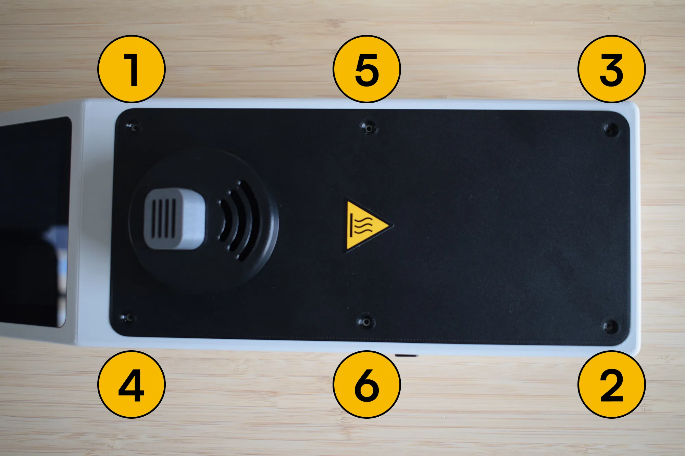

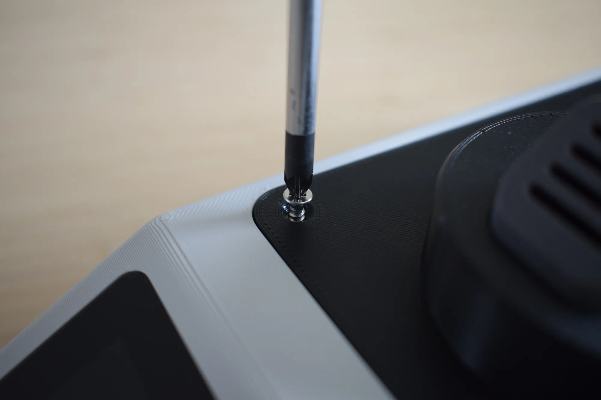

**h.** Once all screws are secured, confirm that the assembly matches the image below before continuing.

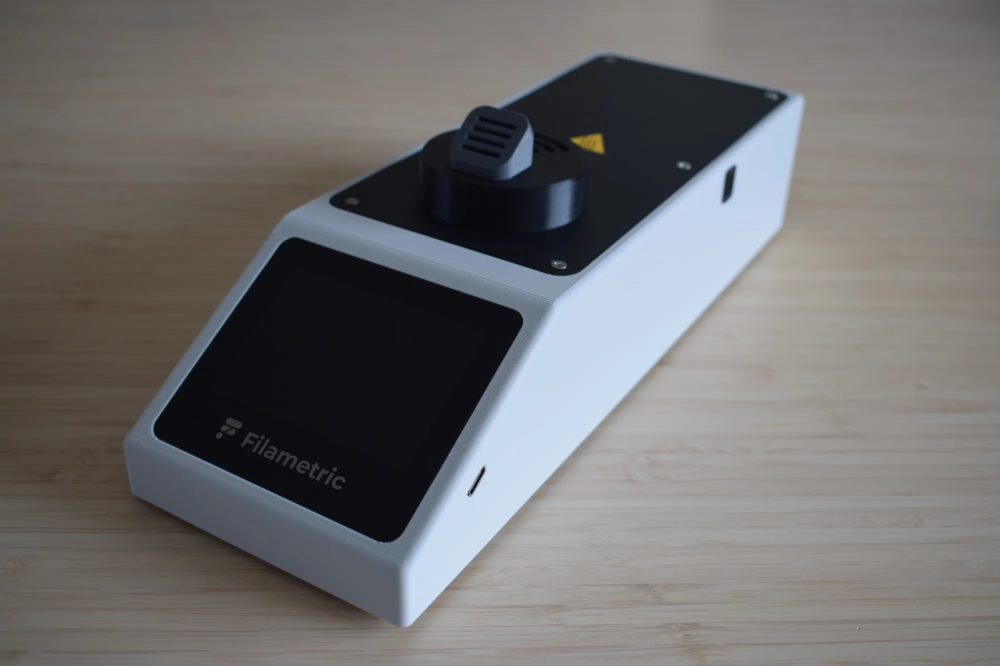

**i.** Insert the C5 power cord into the inlet on the back of the housing. Make sure it is pushed in fully and sits flush, as shown in the correct and incorrect images below. Connect the other end of the power cord to a wall outlet. The DryBase will power on automatically and the display should light up and show the home screen within a few seconds.

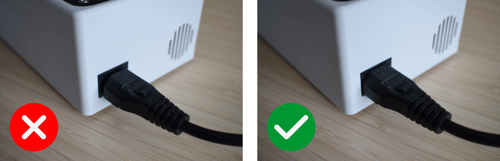

---

**Congratulations!** You have successfully assembled your DryBase.

Your DryBase is now fully assembled and powered on. The display should light up and show the home screen, as shown in the image below. You are ready to start drying. Before continuing, take a moment to verify the following:

- [x] No visible gap exists between the heating unit and the housing on any side
- [x] The moist air exhaust port is flush with the right side of the housing
- [x] No wires are visible or pinched along the edges
- [x] All six countersunk screws are secured
- [x] The C5 power cord is fully seated and the display powers on

If the display does not turn on, check that the power cord is fully seated and that the wall outlet is active. If the issue persists, contact us at [support@filametric.com](mailto:support@filametric.com).

---

[:octicons-arrow-right-24: Chapter 6: DryBox assembly](chapter-6-drybox-assembly.md){ .md-button .md-button--primary }
