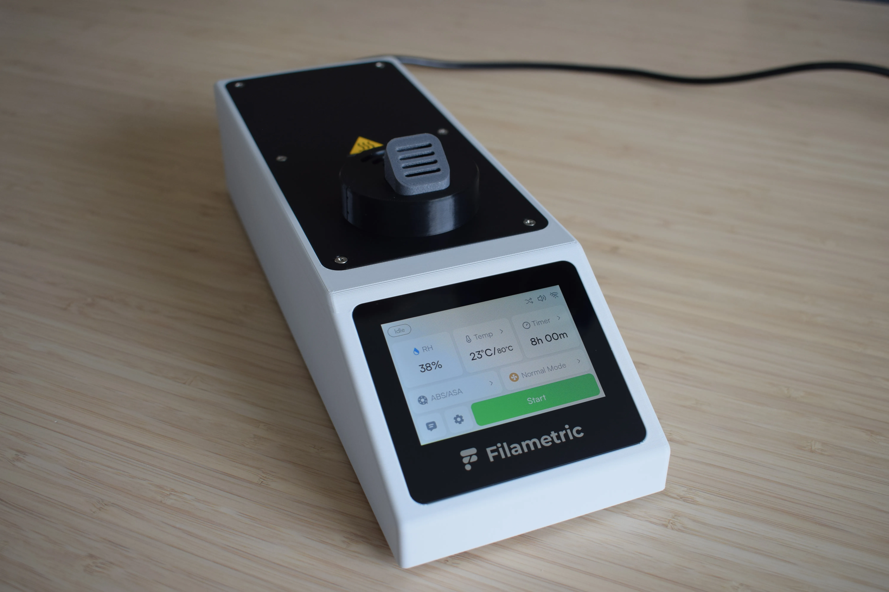

# Introduction

The DryBase was designed for one purpose: to dry filament properly. Not just warm it up, but actually remove moisture, at temperatures high enough to make a real difference for engineering-grade materials. At the same time, we wanted it to stay compact and compatible with the well-known affordable cereal containers the community already loves. The result is DryBase.

These instructions will guide you through the full assembly process, step by step. Each chapter covers a distinct part of the build, and every step includes reference images so you always know what a correct result looks like.

## What's ahead

The assembly is split into six chapters. You'll start by checking your kit contents, then work your way through preparing, building, and finally putting everything together.

| | Chapter | What you'll do |
|---|---------|---------------|
| 1 | [Unboxing & checking components](chapter-1-unboxing.md) | Verify your kit contents and gather tools |
| 2 | [Preparing the DryBase housing](chapter-2-preparing-housing.md) | Install heat-set inserts and prep the printed parts |
| 3 | [Housing assembly](chapter-3-housing-assembly.md) | Assemble the main housing structure |
| 4 | [Heating unit assembly](chapter-4-heating-unit-assembly.md) | Build the heating unit |
| 5 | [DryBase assembly](chapter-5-drybase-assembly.md) | Combine housing and heating unit into the final DryBase |
| 6 | [Drybox assembly](chapter-6-drybox-assembly.md) | Set up the drybox container |

## Before you begin

You will need a clean, flat surface and about **3 hours** to complete all chapters. The kit includes most of what you need. A small number of items are not included and are listed in [Chapter 1](chapter-1-unboxing.md) for the DryBase and [Chapter 6](chapter-6-drybox-assembly.md) for the drybox.

!!! warning "Take your time"
    If something doesn't fit or look right, stop and check before continuing. A little patience here saves a lot of trouble later.

!!! note "Need help?"
    If you run into any issues, reach out at [support@filametric.com](mailto:support@filametric.com). We're happy to help.

---

[:octicons-arrow-right-24: Continue to Chapter 1: Unboxing & checking components](chapter-1-unboxing.md){ .md-button .md-button--primary }
